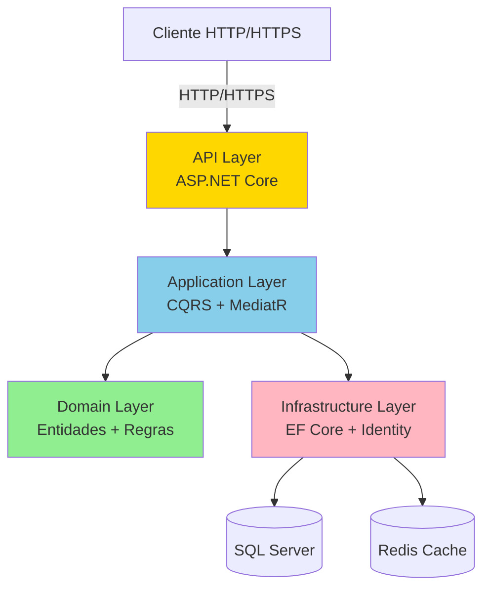

# Visão Geral do Sistema

## Introdução

O **Employee Management API** é um sistema robusto de gerenciamento de funcionários desenvolvido com **.NET 8**, projetado para oferecer controle completo sobre o cadastro, autenticação, autorização e gestão de colaboradores em uma organização.

## Propósito

Este sistema foi desenvolvido para:

- **Centralizar** o gerenciamento de informações de funcionários
- **Garantir segurança** através de autenticação JWT e hierarquia de permissões
- **Facilitar operações** de CRUD com validações robustas
- **Manter auditoria** completa de todas as operações
- **Escalar horizontalmente** através de arquitetura moderna e containerização

## Contexto de Negócio

O sistema atende às necessidades de organizações que precisam:

- Gerenciar cadastros de funcionários com dados completos (nome, email, documento, telefones, data de nascimento)
- Implementar hierarquia organizacional com gestores e subordinados
- Controlar acesso baseado em níveis de permissão
- Rastrear mudanças e manter histórico de alterações
- Garantir conformidade com políticas de segurança de senha
- Gerenciar sessões de usuários com tokens de acesso e renovação

## Principais Funcionalidades

### 1. Autenticação e Autorização

- **Login seguro** com email e senha
- **JWT (JSON Web Token)** para autenticação stateless
- **Access Token** com validade de 15 minutos
- **Refresh Token** com validade de 7 dias e rotação automática
- **Revogação de tokens** individual ou em massa
- **Reset de senha** com tokens temporários
- **Alteração de senha** com validação da senha atual

### 2. Gerenciamento de Funcionários

#### Operações CRUD Completas

- **Criar** novos funcionários com validações rigorosas
- **Listar** funcionários com:
  - Paginação configurável
  - Filtros múltiplos (nome, email, role, gestor)
  - Busca textual genérica
  - Ordenação customizável
- **Consultar** funcionário por ID
- **Atualizar** dados de funcionários existentes
- **Excluir** funcionários (soft delete)

#### Validações de Negócio

- Nome e sobrenome obrigatórios (mínimo 2 caracteres, sem números)
- Email único e formato válido
- Documento único e obrigatório
- Idade mínima de 18 anos
- Pelo menos um telefone cadastrado
- Senha forte (mínimo 8 caracteres, maiúscula, minúscula, número, caractere especial)

### 3. Hierarquia de Permissões

O sistema implementa 4 níveis hierárquicos de permissão:

| Nível | Role | Permissões |
|-------|------|------------|
| 1 | **Employee** | Apenas leitura de funcionários |
| 2 | **Leader** | Leitura + Criação/Edição de Employees |
| 3 | **Director** | Acesso completo a operações de funcionários |
| 4 | **Admin** | Acesso total ao sistema (incluindo gestão de usuários e roles) |

**Regra de Hierarquia**: Um usuário só pode criar/editar funcionários com permissões inferiores às suas.

### 4. Gestão de Senhas

- **Hashing seguro** com ASP.NET Identity
- **Políticas de complexidade** configuráveis
- **Bloqueio de conta** após 5 tentativas falhas (15 minutos)
- **Tokens de reset** com validade de 2 horas
- **Histórico de senhas** (prevenção de reutilização)

### 5. Auditoria e Rastreabilidade

Todas as entidades incluem campos de auditoria automática:

- `CreatedAt` / `CreatedBy` - Data e usuário de criação
- `UpdatedAt` / `UpdatedBy` - Data e usuário da última atualização
- `DeletedAt` / `DeletedBy` - Data e usuário da exclusão (soft delete)
- `IsDeleted` - Flag de exclusão lógica

### 6. Soft Delete

- Exclusões são **lógicas**, não físicas
- Dados preservados para auditoria e conformidade
- Query filters automáticos ocultam registros deletados
- Possibilidade de recuperação de dados

## Stack Tecnológica

### Backend

- **.NET 8** - Framework principal
- **ASP.NET Core Web API** - Camada de apresentação
- **Entity Framework Core 8** - ORM e acesso a dados
- **ASP.NET Identity** - Autenticação e autorização
- **MediatR** - Implementação de CQRS e mediator pattern
- **FluentValidation** - Validações de entrada
- **AutoMapper** - Mapeamento de objetos

### Banco de Dados

- **SQL Server 2022** - Banco de dados relacional principal
- **Redis** (opcional) - Cache distribuído

### Segurança

- **JWT (JSON Web Tokens)** - Autenticação stateless
- **BCrypt** - Hashing de senhas
- **HTTPS/TLS** - Comunicação criptografada
- **CORS** - Controle de origem cruzada
- **Rate Limiting** - Proteção contra abuso

### Infraestrutura

- **Docker** - Containerização
- **Docker Compose** - Orquestração de containers
- **Swagger/OpenAPI** - Documentação interativa da API

### Testes

- **xUnit** - Framework de testes unitários
- **SpecFlow** - Testes BDD (Behavior-Driven Development)
- **Moq** - Framework de mocking
- **FluentAssertions** - Assertions fluentes
- **Bogus** - Geração de dados fake

### Observabilidade

- **Serilog** (integrado) - Logging estruturado
- **Health Checks** - Monitoramento de saúde da aplicação
- **Correlation ID** - Rastreamento de requisições

## Requisitos de Sistema

### Para Desenvolvimento

- **.NET 8 SDK** ou superior
- **Docker Desktop** (para execução em containers)
- **SQL Server 2022** (ou container Docker)
- **IDE**: Visual Studio 2022, VS Code ou Rider
- **Git** para controle de versão

### Para Produção

- **Servidor Linux/Windows** com suporte a .NET 8
- **SQL Server 2019+** ou Azure SQL Database
- **Redis** (opcional, para cache distribuído)
- **Reverse Proxy**: Nginx, IIS ou Azure App Service
- **Certificado SSL/TLS** válido

### Requisitos de Hardware (Mínimos)

- **CPU**: 2 cores
- **RAM**: 4 GB
- **Disco**: 10 GB de espaço livre
- **Rede**: Conexão estável para acesso ao banco de dados

## Arquitetura de Alto Nível

## Princípios Arquiteturais

O sistema foi construído seguindo princípios sólidos de engenharia de software:

- **Clean Architecture** - Separação clara de responsabilidades em camadas
- **Domain-Driven Design (DDD)** - Modelagem rica do domínio
- **SOLID** - Princípios de design orientado a objetos
- **CQRS** - Separação de comandos e consultas
- **Event-Driven** - Comunicação através de eventos de domínio
- **Fail-Fast** - Validações antecipadas com Result Pattern

## Endpoints Principais

### Autenticação

- `POST /api/auth/login` - Login
- `POST /api/auth/refresh-token` - Renovar token
- `POST /api/auth/revoke-token` - Revogar token
- `POST /api/auth/change-password` - Alterar senha
- `GET /api/auth/me` - Dados do usuário atual

### Funcionários

- `GET /api/employees` - Listar funcionários (com filtros)
- `GET /api/employees/{id}` - Buscar por ID
- `POST /api/employees` - Criar funcionário
- `PUT /api/employees/{id}` - Atualizar funcionário
- `DELETE /api/employees/{id}` - Excluir funcionário

## URLs de Acesso

| Ambiente | HTTP | HTTPS | Swagger |
|----------|------|-------|---------|
| **Docker** | http://localhost:59687 | https://localhost:59687 | http://localhost:59687/swagger |
| **Local** | http://localhost:59687 | https://localhost:59687 | http://localhost:59687/swagger |

## Credenciais Padrão

O sistema é inicializado com usuários de exemplo (seeding):

| Email | Senha | Role |
|-------|-------|------|
| admin@empresa.com | Admin@123 | Admin |
| director@empresa.com | Director@123 | Director |
| leader@empresa.com | Leader@123 | Leader |
| employee@empresa.com | Employee@123 | Employee |

> ⚠️ **Importante**: Altere estas credenciais em ambiente de produção!

## Próximos Passos

Para começar a trabalhar com o sistema:

1. Consulte o [Guia de Desenvolvimento](13-GUIA-DESENVOLVIMENTO.md) para configurar o ambiente
2. Leia sobre a [Arquitetura](02-ARQUITETURA.md) para entender a estrutura
3. Explore a [API Reference](12-API-REFERENCE.md) para conhecer os endpoints
4. Veja [Docker e Deploy](10-DOCKER-DEPLOY.md) para executar em containers

## Suporte e Documentação

- **Documentação Técnica**: Pasta `/docs`
- **Swagger UI**: Disponível em `/swagger` quando a aplicação está rodando
- **Postman Collection**: Disponível em `/docs/postman/collections`
- **Testes BDD**: Features em `/tests/EmployeeManagement.Tests/Features`

---

**Versão do Sistema**: 1.0  
**Última Atualização**: Dezembro 2025  
**Framework**: .NET 8.0

