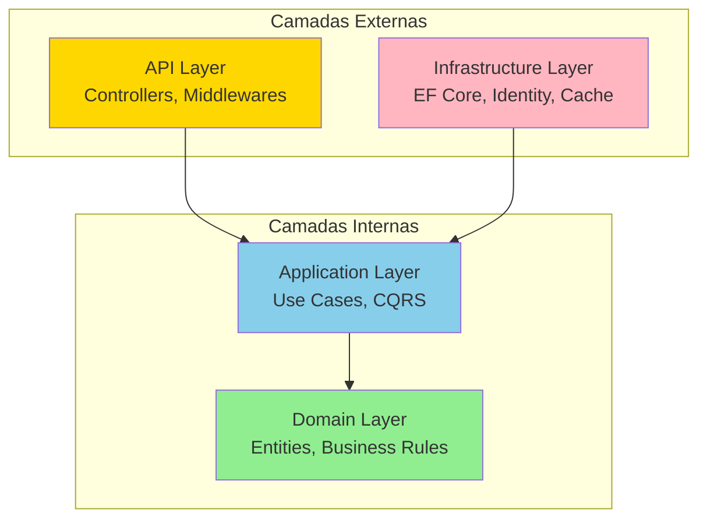
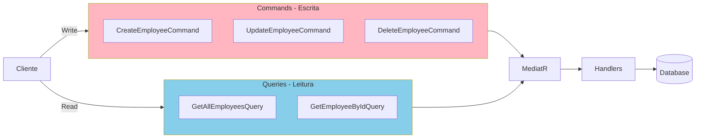
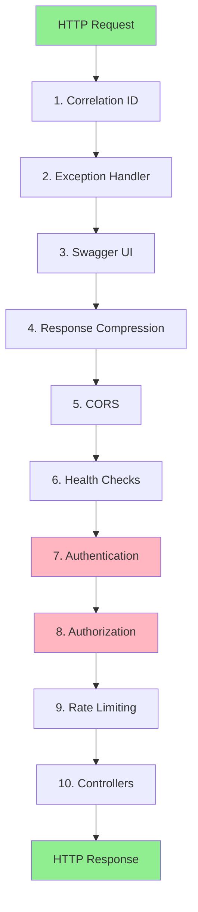
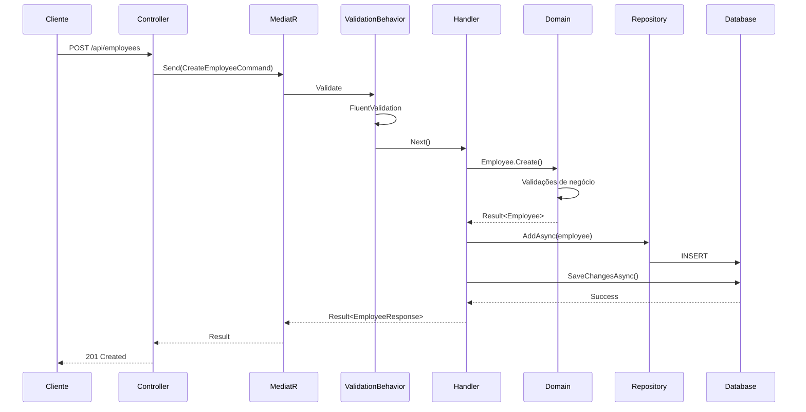
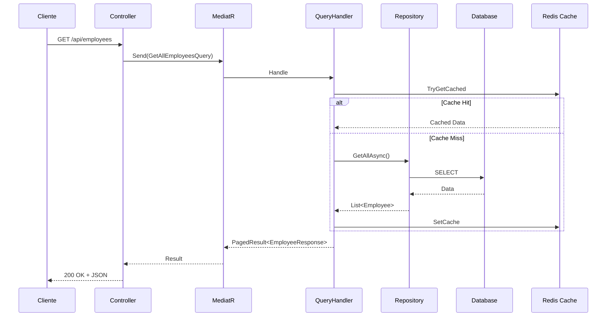

# Arquitetura do Sistema

## Introdução

O **Employee Management API** foi desenvolvido seguindo os princípios de **Clean Architecture** (Arquitetura Limpa), proposta por Robert C. Martin (Uncle Bob). Esta abordagem garante separação clara de responsabilidades, testabilidade, manutenibilidade e independência de frameworks e tecnologias externas.

## Clean Architecture

### Visão Geral das Camadas



### Princípio de Dependência

A regra fundamental da Clean Architecture é a **Regra de Dependência**:

> As dependências do código-fonte devem apontar apenas para dentro, em direção às políticas de alto nível.

**Fluxo de Dependências:**
```
API → Application → Domain
Infrastructure → Application → Domain
```

**Importante**: O Domain NUNCA depende de outras camadas!

## Camadas da Aplicação

### 1. Domain Layer (Camada de Domínio)

**Localização**: `src/EmployeeManagement/EmployeeManagement.Domain`

**Responsabilidades**:
- Definir entidades e agregados
- Implementar regras de negócio
- Definir interfaces de repositórios
- Gerenciar eventos de domínio
- Criar value objects

**Características**:
- ✅ Sem dependências externas
- ✅ Puro C# (.NET)
- ✅ Lógica de negócio centralizada
- ✅ Testável isoladamente

**Estrutura**:
```
Domain/
├── Common/
│   ├── Entity.cs              # Classe base para entidades
│   ├── Result.cs              # Result Pattern
│   ├── Error.cs               # Representação de erros
│   └── IDomainEvent.cs        # Interface para eventos
├── Entities/
│   ├── Employee.cs            # Agregado principal
│   ├── PhoneNumber.cs         # Entidade dependente
│   └── Entity.cs              # Base class com auditoria
├── ValueObjects/
│   └── [Value Objects]
├── Enums/
│   └── Role.cs                # Enum de permissões
├── Events/
│   ├── EmployeeCreatedEvent.cs
│   ├── EmployeeUpdatedEvent.cs
│   ├── EmployeeDeletedEvent.cs
│   ├── EmployeeRoleChangedEvent.cs
│   └── PasswordChangedEvent.cs
├── Interfaces/
│   ├── IEmployeeRepository.cs
│   └── IUnitOfWork.cs
└── Exceptions/
    └── DomainException.cs
```

**Exemplo de Entidade**:

```csharp
public class Employee : Entity
{
    public string FirstName { get; private set; }
    public string LastName { get; private set; }
    public string Email { get; private set; }
    public Role Role { get; private set; }
    
    // Factory Method com validações
    public static Result<Employee> Create(...)
    {
        // Validações de negócio
        if (string.IsNullOrWhiteSpace(firstName))
            return Result<Employee>.Failure(Error.Validation(...));
            
        var employee = new Employee { ... };
        employee.RaiseDomainEvent(new EmployeeCreatedEvent(...));
        return Result<Employee>.Success(employee);
    }
}
```

### 2. Application Layer (Camada de Aplicação)

**Localização**: `src/EmployeeManagement/EmployeeManagement.Application`

**Responsabilidades**:
- Implementar casos de uso (use cases)
- Orquestrar fluxo de dados
- Validar entrada de dados
- Coordenar transações
- Publicar eventos de domínio

**Padrões Implementados**:
- **CQRS** (Command Query Responsibility Segregation)
- **Mediator Pattern** (via MediatR)
- **Pipeline Behaviors**
- **FluentValidation**

**Estrutura**:
```
Application/
├── Common/
│   ├── Behaviors/
│   │   ├── ValidationBehavior.cs      # Validação automática
│   │   └── LoggingBehavior.cs         # Logging de requests
│   ├── Mappings/
│   └── PagedResult.cs
├── DTOs/
│   └── [Data Transfer Objects]
├── Features/
│   ├── Auth/
│   │   ├── Commands/
│   │   │   ├── Login/
│   │   │   │   ├── LoginCommand.cs
│   │   │   │   ├── LoginCommandHandler.cs
│   │   │   │   └── LoginCommandValidator.cs
│   │   │   └── ChangePassword/
│   │   └── Common/
│   │       └── AuthResponse.cs
│   └── Employees/
│       ├── Commands/
│       │   ├── CreateEmployee/
│       │   ├── UpdateEmployee/
│       │   └── DeleteEmployee/
│       ├── Queries/
│       │   ├── GetAllEmployees/
│       │   ├── GetEmployeeById/
│       │   └── GetEmployeeByEmail/
│       ├── Common/
│       │   └── EmployeeResponse.cs
│       └── Events/
│           ├── EmployeeCreatedEventHandler.cs
│           └── PasswordChangedEventHandler.cs
├── Interfaces/
│   ├── IAuthService.cs
│   ├── IIdentityService.cs
│   └── ICacheService.cs
├── Services/
│   └── AuthService.cs
└── DependencyInjection.cs
```

**CQRS Pattern**:



**Exemplo de Command**:

```csharp
public record CreateEmployeeCommand(
    string FirstName,
    string LastName,
    string Email,
    // ... outros campos
    Role CurrentUserRole
) : IRequest<Result<EmployeeResponse>>;

public class CreateEmployeeCommandHandler 
    : IRequestHandler<CreateEmployeeCommand, Result<EmployeeResponse>>
{
    public async Task<Result<EmployeeResponse>> Handle(
        CreateEmployeeCommand request, 
        CancellationToken cancellationToken)
    {
        // 1. Validar permissões
        // 2. Criar entidade
        // 3. Persistir
        // 4. Retornar resultado
    }
}
```

### 3. Infrastructure Layer (Camada de Infraestrutura)

**Localização**: `src/EmployeeManagement/EmployeeManagement.Infrastructure`

**Responsabilidades**:
- Implementar acesso a dados (EF Core)
- Gerenciar identidade e autenticação
- Implementar cache
- Integrar com serviços externos
- Implementar repositórios

**Estrutura**:
```
Infrastructure/
├── Persistence/
│   ├── AppDbContext.cs                # DbContext principal
│   ├── Configurations/
│   │   ├── EmployeeConfiguration.cs   # Fluent API
│   │   └── PhoneNumberConfiguration.cs
│   ├── Repositories/
│   │   └── EmployeeRepository.cs
│   ├── Migrations/
│   └── DbSeeder.cs
├── Identity/
│   ├── AppIdentityDbContext.cs
│   ├── ApplicationUser.cs
│   ├── ApplicationRole.cs
│   ├── RefreshToken.cs
│   ├── IdentityService.cs
│   └── IdentitySeeder.cs
├── Caching/
│   └── RedisCacheService.cs
├── Security/
│   ├── JwtService.cs
│   └── PasswordHasher.cs
├── Services/
│   └── CurrentUserService.cs
└── DependencyInjection.cs
```

**DbContext com Domain Events**:

```csharp
public class AppDbContext : DbContext, IUnitOfWork
{
    private readonly IPublisher _publisher;
    
    public override async Task<int> SaveChangesAsync(...)
    {
        // 1. Aplicar auditoria automática
        // 2. Coletar domain events
        // 3. Salvar mudanças
        // 4. Publicar eventos
        
        var domainEvents = ChangeTracker.Entries<Entity>()
            .SelectMany(e => e.Entity.DomainEvents)
            .ToList();
            
        var result = await base.SaveChangesAsync(cancellationToken);
        
        foreach (var domainEvent in domainEvents)
            await _publisher.Publish(domainEvent, cancellationToken);
            
        return result;
    }
}
```

### 4. API Layer (Camada de Apresentação)

**Localização**: `src/EmployeeManagement/EmployeeManagement.Api`

**Responsabilidades**:
- Expor endpoints HTTP
- Validar entrada HTTP
- Serializar/deserializar JSON
- Gerenciar autenticação JWT
- Aplicar middlewares
- Documentar API (Swagger)

**Estrutura**:
```
Api/
├── Controllers/
│   ├── MainController.cs              # Controller base
│   └── ErrorContractController.cs
├── V1/
│   └── Controllers/
│       ├── AuthController.cs
│       └── EmployeesController.cs
├── V2/
│   └── Controllers/
│       └── EmployeesController.cs
├── Middlewares/
│   ├── GlobalExceptionMiddleware.cs
│   ├── CorrelationIdMiddleware.cs
│   └── RequestLoggingMiddleware.cs
├── Configurations/
│   ├── SwaggerConfiguration.cs
│   ├── CorsConfiguration.cs
│   ├── RateLimitingConfiguration.cs
│   ├── CompressionConfiguration.cs
│   ├── HealthCheckConfiguration.cs
│   └── ApiVersioningConfiguration.cs
├── Extensions/
│   └── ServiceCollectionExtensions.cs
├── Contracts/
│   └── [Request/Response DTOs]
├── Infrastructure/
│   └── ProblemDetailsFactory.cs
└── Program.cs
```

**Pipeline de Middleware**:



## Padrões de Design Implementados

### 1. CQRS (Command Query Responsibility Segregation)

**Separação de Comandos e Consultas**:

- **Commands**: Alteram estado (Create, Update, Delete)
- **Queries**: Apenas leitura (Get, List)

**Benefícios**:
- Otimização independente
- Escalabilidade
- Clareza de intenção
- Facilita testes

### 2. Mediator Pattern

**Implementação**: MediatR

**Vantagens**:
- Desacoplamento entre camadas
- Pipeline de behaviors
- Fácil adição de cross-cutting concerns

```csharp
// Controller envia comando via Mediator
var command = new CreateEmployeeCommand(...);
var result = await _sender.Send(command, cancellationToken);
```

### 3. Repository Pattern

**Interface no Domain, Implementação na Infrastructure**:

```csharp
// Domain/Interfaces/IEmployeeRepository.cs
public interface IEmployeeRepository
{
    Task<Employee?> GetByIdAsync(Guid id, CancellationToken ct);
    Task<Employee?> GetByEmailAsync(string email, CancellationToken ct);
    Task AddAsync(Employee employee, CancellationToken ct);
}

// Infrastructure/Repositories/EmployeeRepository.cs
public class EmployeeRepository : IEmployeeRepository
{
    private readonly AppDbContext _context;
    // Implementação...
}
```

### 4. Unit of Work Pattern

**DbContext como Unit of Work**:

```csharp
public interface IUnitOfWork
{
    Task<int> SaveChangesAsync(CancellationToken ct = default);
}

// AppDbContext implementa IUnitOfWork
```

### 5. Result Pattern

**Tratamento de erros sem exceções**:

```csharp
public class Result<T>
{
    public bool IsSuccess { get; }
    public bool IsFailure => !IsSuccess;
    public T Value { get; }
    public Error Error { get; }
    
    public static Result<T> Success(T value) => new(value, true, Error.None);
    public static Result<T> Failure(Error error) => new(default, false, error);
}

// Uso
var result = Employee.Create(...);
if (result.IsFailure)
    return BadRequest(result.Error);
```

### 6. Domain Events

**Comunicação entre agregados**:

```csharp
// Entidade levanta evento
employee.RaiseDomainEvent(new EmployeeCreatedEvent(employee.Id));

// Handler reage ao evento
public class EmployeeCreatedEventHandler 
    : INotificationHandler<EmployeeCreatedEvent>
{
    public async Task Handle(EmployeeCreatedEvent notification, ...)
    {
        // Lógica adicional (enviar email, log, etc.)
    }
}
```

### 7. Pipeline Behaviors

**Cross-cutting concerns**:

```csharp
// ValidationBehavior - executa antes do handler
public class ValidationBehavior<TRequest, TResponse> 
    : IPipelineBehavior<TRequest, TResponse>
{
    public async Task<TResponse> Handle(...)
    {
        // Validar request
        if (validationFailed)
            return Result.Failure(...);
            
        return await next(); // Continua pipeline
    }
}
```

### 8. Factory Method

**Criação de entidades com validação**:

```csharp
public static Result<Employee> Create(
    string firstName,
    string lastName,
    // ... parâmetros
)
{
    // Validações
    if (string.IsNullOrWhiteSpace(firstName))
        return Result<Employee>.Failure(Error.Validation(...));
        
    var employee = new Employee { ... };
    return Result<Employee>.Success(employee);
}
```

## Fluxo de Dados Completo

### Criação de Funcionário (Command)



### Consulta de Funcionários (Query)



## Injeção de Dependências

Cada camada registra seus serviços:

```csharp
// Application/DependencyInjection.cs
public static IServiceCollection AddApplication(this IServiceCollection services)
{
    services.AddMediatR(config => {
        config.RegisterServicesFromAssembly(assembly);
        config.AddOpenBehavior(typeof(ValidationBehavior<,>));
        config.AddOpenBehavior(typeof(LoggingBehavior<,>));
    });
    services.AddValidatorsFromAssembly(assembly);
    return services;
}

// Infrastructure/DependencyInjection.cs
public static IServiceCollection AddInfrastructure(...)
{
    services.AddDbContext<AppDbContext>(...);
    services.AddScoped<IEmployeeRepository, EmployeeRepository>();
    services.AddScoped<IUnitOfWork>(provider => 
        provider.GetRequiredService<AppDbContext>());
    return services;
}

// API/Program.cs
builder.Services.AddApplication();
builder.Services.AddInfrastructure(configuration);
```

## Testabilidade

A arquitetura facilita testes em todos os níveis:

```csharp
// Teste de Domain (sem dependências)
[Fact]
public void Employee_Create_WithInvalidEmail_ShouldFail()
{
    var result = Employee.Create("John", "Doe", "invalid-email", ...);
    result.IsFailure.Should().BeTrue();
}

// Teste de Handler (com mocks)
[Fact]
public async Task CreateEmployee_ValidData_ShouldSucceed()
{
    var mockRepo = new Mock<IEmployeeRepository>();
    var handler = new CreateEmployeeCommandHandler(mockRepo.Object, ...);
    
    var result = await handler.Handle(command, CancellationToken.None);
    
    result.IsSuccess.Should().BeTrue();
    mockRepo.Verify(r => r.AddAsync(It.IsAny<Employee>(), ...), Times.Once);
}
```

## Benefícios da Arquitetura

✅ **Manutenibilidade**: Código organizado e fácil de entender  
✅ **Testabilidade**: Cada camada pode ser testada isoladamente  
✅ **Escalabilidade**: Fácil adicionar novos recursos  
✅ **Independência**: Frameworks podem ser trocados sem afetar o domínio  
✅ **Clareza**: Separação clara de responsabilidades  
✅ **Reutilização**: Lógica de negócio pode ser reutilizada  
✅ **Evolução**: Sistema pode crescer de forma sustentável

## Próximos Passos

- [Camada de Domínio](03-DOMINIO.md) - Detalhes sobre entidades e regras de negócio
- [Camada de Aplicação](04-APLICACAO.md) - CQRS, handlers e validações
- [Camada de Infraestrutura](05-INFRAESTRUTURA.md) - Persistência e serviços
- [Camada de API](06-API.md) - Controllers e middlewares

