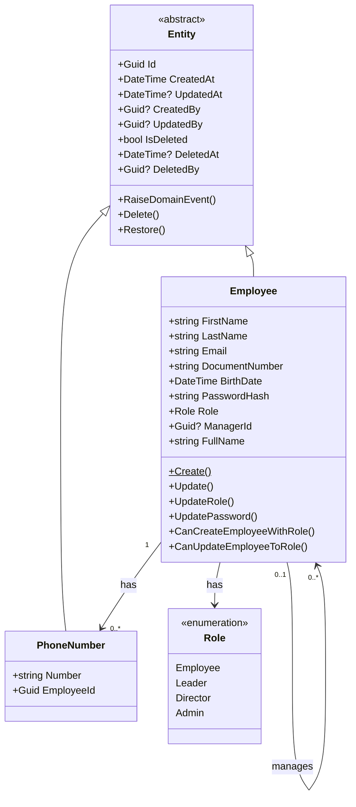

# Camada de Domínio

## Introdução

A **Camada de Domínio** é o coração do sistema, contendo toda a lógica de negócio, regras e conhecimento do domínio. Esta camada é completamente independente de frameworks, bibliotecas externas e detalhes de infraestrutura, seguindo os princípios de **Domain-Driven Design (DDD)**.

**Localização**: `src/EmployeeManagement/EmployeeManagement.Domain`

## Princípios Fundamentais

### 1. Independência Total

- ✅ **Sem dependências externas** (exceto .NET base)
- ✅ **Não conhece** banco de dados, API, frameworks
- ✅ **Focada** apenas em regras de negócio
- ✅ **Testável** sem infraestrutura

### 2. Linguagem Ubíqua

O código reflete a linguagem do negócio:
- `Employee` (Funcionário)
- `Role` (Permissão/Cargo)
- `Manager` (Gestor)
- `Subordinates` (Subordinados)

### 3. Encapsulamento

- Propriedades com `private set`
- Criação via Factory Methods
- Validações no domínio
- Estado sempre consistente

## Estrutura da Camada

```
Domain/
├── Common/
│   ├── IDomainEvent.cs          # Interface para eventos
│   ├── Result.cs                # Result Pattern
│   ├── ErrorContract.cs         # Representação de erros
│   └── PagedResult.cs           # Resultado paginado
├── Entities/
│   ├── Entity.cs                # Classe base
│   ├── Employee.cs              # Agregado raiz
│   └── PhoneNumber.cs           # Entidade dependente
├── Enums/
│   └── Role.cs                  # Enum de permissões
├── Events/
│   ├── EmployeeCreatedEvent.cs
│   ├── EmployeeUpdatedEvent.cs
│   ├── EmployeeDeletedEvent.cs
│   ├── EmployeeRoleChangedEvent.cs
│   └── PasswordChangedEvent.cs
├── Interfaces/
│   ├── IEmployeeRepository.cs   # Contrato do repositório
│   └── IUnitOfWork.cs           # Contrato de transação
└── Exceptions/
    └── DomainException.cs       # Exceções de domínio
```

## Entidades

### Entity (Classe Base)

Todas as entidades herdam de `Entity`, que fornece:

**Campos de Identidade**:
```csharp
public Guid Id { get; protected set; } = Guid.NewGuid();
```

**Campos de Auditoria**:
```csharp
public DateTime CreatedAt { get; protected set; }
public DateTime? UpdatedAt { get; protected set; }
public Guid? CreatedBy { get; protected set; }
public Guid? UpdatedBy { get; protected set; }
```

**Soft Delete**:
```csharp
public bool IsDeleted { get; protected set; }
public DateTime? DeletedAt { get; protected set; }
public Guid? DeletedBy { get; protected set; }
```

**Domain Events**:
```csharp
private readonly List<IDomainEvent> _domainEvents = [];
public IReadOnlyCollection<IDomainEvent> DomainEvents => _domainEvents.AsReadOnly();

protected void RaiseDomainEvent(IDomainEvent domainEvent) =>
    _domainEvents.Add(domainEvent);
```

**Métodos de Auditoria**:
```csharp
public void SetCreatedBy(Guid? userId)
public void SetUpdatedBy(Guid? userId)
public virtual void Delete(Guid? deletedBy = null)
public virtual void Restore()
```

### Employee (Agregado Raiz)

O `Employee` é o **agregado raiz** principal do sistema.

**Propriedades**:

```csharp
public class Employee : Entity
{
    // Dados Pessoais
    public string FirstName { get; private set; }
    public string LastName { get; private set; }
    public string Email { get; private set; }
    public string DocumentNumber { get; private set; }
    public DateTime BirthDate { get; private set; }
    
    // Segurança
    public string PasswordHash { get; private set; }
    public Role Role { get; private set; }
    
    // Hierarquia
    public Guid? ManagerId { get; private set; }
    public Employee? Manager { get; private set; }
    
    // Coleções
    private readonly List<PhoneNumber> _phoneNumbers = [];
    public IReadOnlyCollection<PhoneNumber> PhoneNumbers => _phoneNumbers.AsReadOnly();
    
    private readonly List<Employee> _subordinates = [];
    public IReadOnlyCollection<Employee> Subordinates => _subordinates.AsReadOnly();
    
    // Propriedade Computada
    public string FullName => $"{FirstName} {LastName}";
}
```

**Factory Method - Criação com Validação**:

```csharp
public static Result<Employee> Create(
    string firstName,
    string lastName,
    string email,
    string documentNumber,
    DateTime birthDate,
    string passwordHash,
    Role role,
    Guid? managerId = null,
    IEnumerable<string>? phoneNumbers = null)
{
    // Validação: Nome obrigatório
    if (string.IsNullOrWhiteSpace(firstName))
        return Result<Employee>.Failure(
            Error.Validation("FirstName", "First name is required"));
    
    // Validação: Nome mínimo 2 caracteres
    if (firstName.Trim().Length < 2)
        return Result<Employee>.Failure(
            Error.Validation("FirstName", "Nome deve ter pelo menos 2 caracteres"));
    
    // Validação: Nome sem números
    if (firstName.Any(char.IsDigit))
        return Result<Employee>.Failure(
            Error.Validation("FirstName", "Nome não pode conter números"));
    
    // Validação: Email válido
    if (string.IsNullOrWhiteSpace(email) || !email.Contains('@'))
        return Result<Employee>.Failure(
            Error.Validation("Email", "Invalid email format"));
    
    // Validação: Idade mínima 18 anos
    if (!IsAdultBirthDate(birthDate))
        return Result<Employee>.Failure(
            Error.Validation("BirthDate", "Employee must be at least 18 years old"));
    
    // Validação: Pelo menos um telefone
    if (phoneNumbers == null || !phoneNumbers.Any())
        return Result<Employee>.Failure(
            Error.Validation("PhoneNumbers", "Funcionário deve possuir pelo menos um telefone"));
    
    // Criar entidade
    var employee = new Employee
    {
        FirstName = firstName.Trim(),
        LastName = lastName.Trim(),
        Email = email.ToLowerInvariant().Trim(),
        DocumentNumber = documentNumber.Trim(),
        BirthDate = birthDate.Date,
        PasswordHash = passwordHash,
        Role = role,
        ManagerId = managerId
    };
    
    // Adicionar telefones
    foreach (var phone in phoneNumbers)
    {
        employee.AddPhone(new PhoneNumber(phone, employee.Id));
    }
    
    // Levantar evento de domínio
    employee.RaiseDomainEvent(new EmployeeCreatedEvent(
        employee.Id,
        employee.Email,
        employee.FullName));
    
    return Result<Employee>.Success(employee);
}
```

**Métodos de Negócio**:

```csharp
// Verificar se pode criar funcionário com determinada role
public bool CanCreateEmployeeWithRole(Role targetRole) => Role > targetRole;

// Verificar se pode atualizar funcionário para determinada role
public bool CanUpdateEmployeeToRole(Role targetRole) => Role > targetRole;

// Atualizar dados do funcionário
public Result Update(
    string firstName,
    string lastName,
    string email,
    DateTime birthDate,
    Guid? managerId)
{
    // Validações...
    
    FirstName = firstName.Trim();
    LastName = lastName.Trim();
    Email = email.ToLowerInvariant().Trim();
    BirthDate = birthDate.Date;
    ManagerId = managerId;
    SetUpdatedAt();
    
    RaiseDomainEvent(new EmployeeUpdatedEvent(Id, Email));
    
    return Result.Success();
}

// Atualizar role
public Result UpdateRole(Role newRole)
{
    if (Role == newRole)
        return Result.Success();
    
    var oldRole = Role;
    Role = newRole;
    SetUpdatedAt();
    
    RaiseDomainEvent(new EmployeeRoleChangedEvent(Id, oldRole, newRole));
    
    return Result.Success();
}

// Atualizar senha
public Result UpdatePassword(string passwordHash)
{
    if (string.IsNullOrWhiteSpace(passwordHash))
        return Result.Failure(Error.Validation("Password", "Password is required"));
    
    PasswordHash = passwordHash;
    SetUpdatedAt();
    
    RaiseDomainEvent(new PasswordChangedEvent(Id));
    
    return Result.Success();
}

// Gerenciar telefones
public void AddPhone(PhoneNumber phone) => _phoneNumbers.Add(phone);
public void ClearPhones() => _phoneNumbers.Clear();

// Soft Delete com evento
public override void Delete(Guid? deletedBy = null)
{
    base.Delete(deletedBy);
    RaiseDomainEvent(new EmployeeDeletedEvent(Id, Email));
}
```

**Validação Privada**:

```csharp
private static bool IsAdultBirthDate(DateTime birthDate) =>
    DateTime.UtcNow.AddYears(-18) >= birthDate;
```

### PhoneNumber (Entidade Dependente)

```csharp
public class PhoneNumber : Entity
{
    public string Number { get; private set; } = string.Empty;
    public Guid EmployeeId { get; private set; }
    public Employee Employee { get; private set; } = null!;
    
    private PhoneNumber() { } // EF Core
    
    public PhoneNumber(string number, Guid employeeId)
    {
        Number = number;
        EmployeeId = employeeId;
    }
}
```

**Características**:
- Não pode existir sem um `Employee`
- Não é um agregado raiz
- Parte do agregado `Employee`

## Enums

### Role (Hierarquia de Permissões)

```csharp
public enum Role
{
    Employee = 1,   // Funcionário comum
    Leader = 2,     // Líder de equipe
    Director = 3,   // Diretor
    Admin = 4       // Administrador do sistema
}
```

**Hierarquia**:
```
Admin (4) > Director (3) > Leader (2) > Employee (1)
```

**Regras**:
- Valores numéricos permitem comparação direta
- Usuário só pode gerenciar roles inferiores
- `Role > targetRole` verifica hierarquia

## Domain Events

Events são **imutáveis** (records) e herdam de `DomainEvent`:

### EmployeeCreatedEvent

```csharp
public sealed record EmployeeCreatedEvent(
    Guid EmployeeId,
    string Email,
    string FullName) : DomainEvent;
```

**Quando é levantado**: Após criação bem-sucedida de um funcionário

**Possíveis handlers**:
- Enviar email de boas-vindas
- Criar entrada em sistema de auditoria
- Notificar gestor

### EmployeeUpdatedEvent

```csharp
public sealed record EmployeeUpdatedEvent(
    Guid EmployeeId,
    string Email) : DomainEvent;
```

**Quando é levantado**: Após atualização de dados do funcionário

### EmployeeDeletedEvent

```csharp
public sealed record EmployeeDeletedEvent(
    Guid EmployeeId,
    string Email) : DomainEvent;
```

**Quando é levantado**: Após exclusão (soft delete) de funcionário

### EmployeeRoleChangedEvent

```csharp
public sealed record EmployeeRoleChangedEvent(
    Guid EmployeeId,
    Role OldRole,
    Role NewRole) : DomainEvent;
```

**Quando é levantado**: Após mudança de permissão/cargo

### PasswordChangedEvent

```csharp
public sealed record PasswordChangedEvent(
    Guid EmployeeId) : DomainEvent;
```

**Quando é levantado**: Após alteração de senha

**Possíveis handlers**:
- Enviar email de confirmação
- Revogar todos os tokens ativos
- Registrar em log de segurança

## Result Pattern

O sistema usa **Result Pattern** para tratamento de erros sem exceções.

### Result (sem valor de retorno)

```csharp
public class Result
{
    public bool IsSuccess { get; }
    public bool IsFailure => !IsSuccess;
    public Error Error { get; }
    
    public static Result Success() => new(true, Error.None);
    public static Result Failure(Error error) => new(false, error);
}
```

### Result<T> (com valor de retorno)

```csharp
public class Result<TValue> : Result
{
    public TValue Value => IsSuccess
        ? _value!
        : throw new InvalidOperationException("Cannot access value of a failed result");
    
    public static Result<TValue> Success(TValue value) => new(value, true, Error.None);
    public static Result<TValue> Failure(Error error) => new(default, false, error);
}
```

**Uso**:

```csharp
// Criar funcionário
var result = Employee.Create(...);

if (result.IsFailure)
{
    // Tratar erro
    return BadRequest(result.Error);
}

// Acessar valor
var employee = result.Value;
```

### Error (Representação de Erros)

```csharp
public sealed record Error(string Code, string Description)
{
    public static readonly Error None = new(string.Empty, string.Empty);
    
    // Factory methods
    public static Error NotFound(string entity, Guid id) =>
        new($"{entity}.NotFound", $"{entity} with ID '{id}' was not found");
    
    public static Error Conflict(string entity, string message) =>
        new($"{entity}.Conflict", message);
    
    public static Error Validation(string field, string message) =>
        new($"{field}.Validation", message);
    
    public static Error Forbidden(string message) =>
        new("Authorization.Forbidden", message);
}
```

**Exemplos de Erros**:

```csharp
Error.Validation("FirstName", "Nome é obrigatório")
Error.NotFound("Employee", employeeId)
Error.Conflict("Employee", "Email já cadastrado")
Error.Forbidden("Sem permissão para esta operação")
```

## Interfaces de Repositório

O Domain define **contratos** (interfaces), mas não implementa:

### IEmployeeRepository

```csharp
public interface IEmployeeRepository
{
    Task<Employee?> GetByIdAsync(Guid id, CancellationToken ct);
    Task<Employee?> GetByEmailAsync(string email, CancellationToken ct);
    Task<Employee?> GetByDocumentNumberAsync(string documentNumber, CancellationToken ct);
    Task<bool> ExistsAsync(Guid id, CancellationToken ct);
    Task AddAsync(Employee employee, CancellationToken ct);
    void Update(Employee employee);
    void Delete(Employee employee);
}
```

### IUnitOfWork

```csharp
public interface IUnitOfWork
{
    Task<int> SaveChangesAsync(CancellationToken ct = default);
}
```

**Importante**: Implementações ficam na camada de Infrastructure!

## Regras de Negócio

### Validações de Employee

| Campo | Regras |
|-------|--------|
| **FirstName** | Obrigatório, mínimo 2 caracteres, sem números |
| **LastName** | Obrigatório, mínimo 2 caracteres, máximo 200, sem números |
| **Email** | Obrigatório, formato válido, único no sistema |
| **DocumentNumber** | Obrigatório, único no sistema |
| **BirthDate** | Idade mínima de 18 anos |
| **PhoneNumbers** | Pelo menos um telefone obrigatório |
| **Password** | Mínimo 8 caracteres, maiúscula, minúscula, número, especial |

### Hierarquia de Permissões

```csharp
// Regra: Só pode criar/editar funcionários com role inferior
public bool CanCreateEmployeeWithRole(Role targetRole) => Role > targetRole;

// Exemplos:
// Director (3) pode criar Leader (2) ✅
// Director (3) pode criar Director (3) ❌
// Leader (2) pode criar Employee (1) ✅
// Employee (1) pode criar qualquer um ❌
```

### Soft Delete

- Exclusões são **lógicas**, não físicas
- Flag `IsDeleted = true`
- Campos de auditoria preenchidos
- Evento `EmployeeDeletedEvent` levantado
- Query filters ocultam automaticamente

### Auditoria Automática

Todos os campos de auditoria são preenchidos automaticamente:

```csharp
// Na criação
CreatedAt = DateTime.UtcNow
CreatedBy = currentUserId

// Na atualização
UpdatedAt = DateTime.UtcNow
UpdatedBy = currentUserId

// Na exclusão
IsDeleted = true
DeletedAt = DateTime.UtcNow
DeletedBy = currentUserId
```

## Diagrama de Domínio



## Boas Práticas Implementadas

✅ **Encapsulamento**: Setters privados, estado sempre válido  
✅ **Factory Methods**: Criação controlada com validações  
✅ **Imutabilidade**: Records para eventos e erros  
✅ **Fail-Fast**: Validações antecipadas  
✅ **Rich Domain Model**: Lógica no domínio, não em serviços  
✅ **Domain Events**: Comunicação desacoplada  
✅ **Result Pattern**: Erros explícitos sem exceções  
✅ **Linguagem Ubíqua**: Código reflete o negócio  

## Testabilidade

O Domain é **100% testável** sem infraestrutura:

```csharp
[Fact]
public void Employee_Create_WithInvalidEmail_ShouldFail()
{
    // Arrange
    var invalidEmail = "not-an-email";
    
    // Act
    var result = Employee.Create(
        "John", "Doe", invalidEmail, "12345678900",
        DateTime.Now.AddYears(-25), "hashedPassword",
        Role.Employee, null, new[] { "11999999999" });
    
    // Assert
    result.IsFailure.Should().BeTrue();
    result.Error.Code.Should().Be("Email.Validation");
}

[Fact]
public void Employee_CanCreateEmployeeWithRole_DirectorCanCreateLeader()
{
    // Arrange
    var director = CreateValidEmployee(Role.Director);
    
    // Act
    var canCreate = director.CanCreateEmployeeWithRole(Role.Leader);
    
    // Assert
    canCreate.Should().BeTrue();
}
```

## Próximos Passos

- [Camada de Aplicação](04-APLICACAO.md) - Como o domínio é orquestrado
- [Camada de Infraestrutura](05-INFRAESTRUTURA.md) - Implementação de repositórios
- [Banco de Dados](08-BANCO-DE-DADOS.md) - Como o domínio é persistido
- [Boas Práticas](14-BOAS-PRATICAS.md) - DDD e SOLID em detalhes

