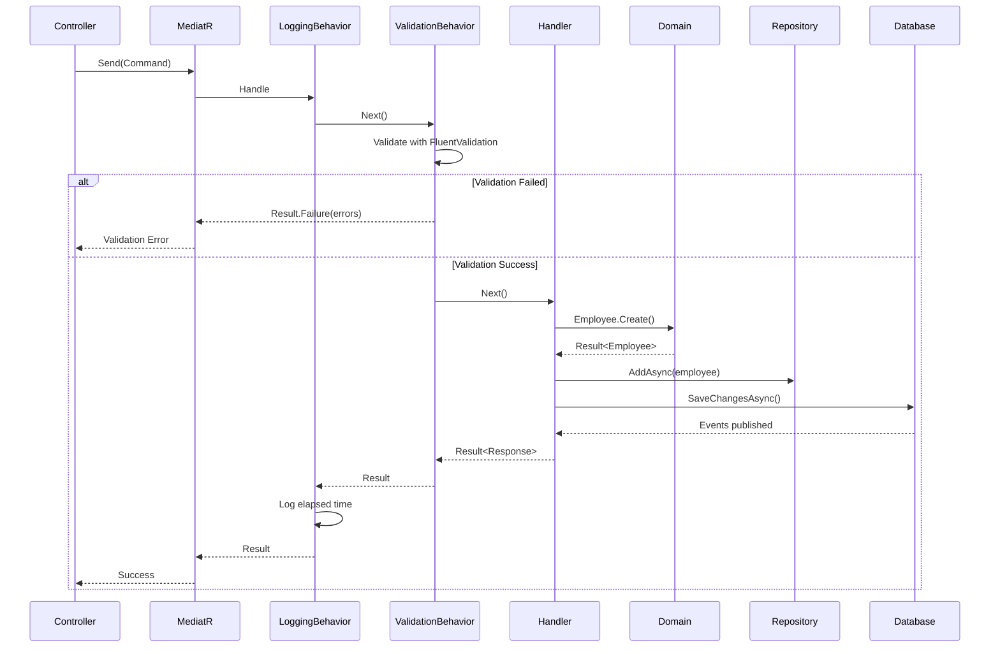

# Camada de Aplicação

## Introdução

A **Camada de Aplicação** orquestra o fluxo de dados entre a API e o Domínio, implementando os casos de uso (use cases) do sistema. Esta camada coordena transações, valida entrada de dados e publica eventos de domínio.

**Localização**: `src/EmployeeManagement/EmployeeManagement.Application`

## Responsabilidades

✅ Implementar casos de uso (use cases)  
✅ Orquestrar fluxo entre camadas  
✅ Validar dados de entrada (FluentValidation)  
✅ Coordenar transações (Unit of Work)  
✅ Mapear entre Domain e DTOs  
✅ Publicar eventos de domínio  

## Padrões Implementados

### CQRS (Command Query Responsibility Segregation)

Separação clara entre operações de **escrita** (Commands) e **leitura** (Queries):

**Commands** - Alteram estado:
- CreateEmployeeCommand
- UpdateEmployeeCommand
- DeleteEmployeeCommand
- ChangePasswordCommand

**Queries** - Apenas leitura:
- GetAllEmployeesQuery
- GetEmployeeByIdQuery
- GetEmployeeByEmailQuery

### Mediator Pattern (MediatR)

Todos os requests passam pelo MediatR, que:
- Desacopla remetente e destinatário
- Permite pipeline de behaviors
- Facilita cross-cutting concerns

```csharp
// Controller envia comando
var command = new CreateEmployeeCommand(...);
var result = await _sender.Send(command, cancellationToken);
```

## Estrutura

```
Application/
├── Common/
│   ├── Behaviors/
│   │   ├── ValidationBehavior.cs      # Validação automática
│   │   └── LoggingBehavior.cs         # Logging e performance
│   ├── Mappings/
│   └── PagedResult.cs
├── DTOs/
│   └── EmployeeDto.cs
├── Features/
│   ├── Auth/
│   │   ├── Commands/
│   │   │   ├── Login/
│   │   │   │   ├── LoginCommand.cs
│   │   │   │   ├── LoginCommandHandler.cs
│   │   │   │   └── LoginCommandValidator.cs
│   │   │   └── ChangePassword/
│   │   └── Common/
│   │       └── AuthResponse.cs
│   └── Employees/
│       ├── Commands/
│       │   ├── CreateEmployee/
│       │   ├── UpdateEmployee/
│       │   └── DeleteEmployee/
│       ├── Queries/
│       │   ├── GetAllEmployees/
│       │   ├── GetEmployeeById/
│       │   └── GetEmployeeByEmail/
│       ├── Common/
│       │   └── EmployeeResponse.cs
│       └── Events/
│           ├── EmployeeCreatedEventHandler.cs
│           └── PasswordChangedEventHandler.cs
├── Interfaces/
│   ├── IAuthService.cs
│   ├── IIdentityService.cs
│   └── ICacheService.cs
├── Services/
│   └── AuthService.cs
└── DependencyInjection.cs
```

## Commands

### Estrutura de um Command

```csharp
// 1. Command (Request)
public record CreateEmployeeCommand(
    string FirstName,
    string LastName,
    string Email,
    string DocumentNumber,
    DateTime BirthDate,
    string Password,
    Role Role,
    Guid? ManagerId,
    List<string> PhoneNumbers,
    Role CurrentUserRole
) : IRequest<Result<EmployeeResponse>>;

// 2. Validator
public class CreateEmployeeCommandValidator : AbstractValidator<CreateEmployeeCommand>
{
    public CreateEmployeeCommandValidator()
    {
        RuleFor(x => x.FirstName)
            .NotEmpty().WithMessage("O nome é obrigatório")
            .MinimumLength(2).WithMessage("Nome deve ter pelo menos 2 caracteres")
            .Must(NotContainNumbers).WithMessage("Nome não pode conter números");
        
        RuleFor(x => x.Email)
            .NotEmpty().WithMessage("Email é obrigatório")
            .EmailAddress().WithMessage("Formato de email inválido");
        
        RuleFor(x => x.BirthDate)
            .Must(BeAtLeast18YearsOld).WithMessage("Funcionário deve ter pelo menos 18 anos");
        
        RuleFor(x => x.Password)
            .MinimumLength(8).WithMessage("Senha deve ter no mínimo 8 caracteres")
            .Matches("[A-Z]").WithMessage("Senha deve conter letra maiúscula")
            .Matches("[a-z]").WithMessage("Senha deve conter letra minúscula")
            .Matches("[0-9]").WithMessage("Senha deve conter número")
            .Matches("[^a-zA-Z0-9]").WithMessage("Senha deve conter caractere especial");
        
        RuleFor(x => x.PhoneNumbers)
            .Must(phones => phones != null && phones.Count > 0)
            .WithMessage("É necessário informar pelo menos um telefone");
    }
    
    private static bool BeAtLeast18YearsOld(DateTime birthDate) => 
        birthDate <= DateTime.UtcNow.AddYears(-18);
}

// 3. Handler
public class CreateEmployeeCommandHandler 
    : IRequestHandler<CreateEmployeeCommand, Result<EmployeeResponse>>
{
    private readonly IEmployeeRepository _employeeRepository;
    private readonly IIdentityService _identityService;
    private readonly IUnitOfWork _unitOfWork;
    
    public async Task<Result<EmployeeResponse>> Handle(
        CreateEmployeeCommand request,
        CancellationToken cancellationToken)
    {
        // 1. Validar permissões
        if (request.CurrentUserRole <= request.Role)
            return Result<EmployeeResponse>.Failure(
                Error.Forbidden("Sem permissão para criar funcionário com esta role"));
        
        // 2. Verificar duplicidade de email
        var existingEmail = await _employeeRepository.GetByEmailAsync(
            request.Email, cancellationToken);
        if (existingEmail != null)
            return Result<EmployeeResponse>.Failure(
                Error.Conflict("Employee", "Email já cadastrado"));
        
        // 3. Verificar duplicidade de documento
        var existingDocument = await _employeeRepository.GetByDocumentNumberAsync(
            request.DocumentNumber, cancellationToken);
        if (existingDocument != null)
            return Result<EmployeeResponse>.Failure(
                Error.Conflict("Employee", "Documento já cadastrado"));
        
        // 4. Hash da senha
        var passwordHash = _identityService.HashPassword(request.Password);
        
        // 5. Criar entidade (Domain)
        var employeeResult = Employee.Create(
            request.FirstName,
            request.LastName,
            request.Email,
            request.DocumentNumber,
            request.BirthDate,
            passwordHash,
            request.Role,
            request.ManagerId,
            request.PhoneNumbers);
        
        if (employeeResult.IsFailure)
            return Result<EmployeeResponse>.Failure(employeeResult.Error);
        
        // 6. Persistir
        await _employeeRepository.AddAsync(employeeResult.Value, cancellationToken);
        await _unitOfWork.SaveChangesAsync(cancellationToken);
        
        // 7. Retornar response
        var response = new EmployeeResponse(
            employeeResult.Value.Id,
            employeeResult.Value.FirstName,
            employeeResult.Value.LastName,
            employeeResult.Value.Email,
            employeeResult.Value.DocumentNumber,
            employeeResult.Value.BirthDate,
            employeeResult.Value.Role,
            employeeResult.Value.ManagerId,
            employeeResult.Value.PhoneNumbers.Select(p => p.Number).ToList());
        
        return Result<EmployeeResponse>.Success(response);
    }
}
```

## Queries

### Estrutura de uma Query

```csharp
// 1. Query (Request)
public record GetAllEmployeesQuery(
    int PageNumber,
    int PageSize,
    string? SearchTerm,
    string? FilterByName,
    string? FilterByEmail,
    Role? FilterByRole,
    Guid? FilterByManagerId,
    string? SortBy,
    bool SortDescending
) : IRequest<PagedResult<EmployeeResponse>>;

// 2. Handler
public class GetAllEmployeesQueryHandler 
    : IRequestHandler<GetAllEmployeesQuery, PagedResult<EmployeeResponse>>
{
    private readonly AppDbContext _context;
    private readonly ICacheService _cacheService;
    
    public async Task<PagedResult<EmployeeResponse>> Handle(
        GetAllEmployeesQuery request,
        CancellationToken cancellationToken)
    {
        // 1. Tentar obter do cache
        var cacheKey = $"employees_{request.PageNumber}_{request.PageSize}_{request.SearchTerm}";
        var cachedResult = await _cacheService.GetAsync<PagedResult<EmployeeResponse>>(cacheKey);
        
        if (cachedResult != null)
            return cachedResult;
        
        // 2. Query no banco
        var query = _context.Employees.AsQueryable();
        
        // 3. Aplicar filtros
        if (!string.IsNullOrWhiteSpace(request.SearchTerm))
        {
            query = query.Where(e => 
                e.FirstName.Contains(request.SearchTerm) ||
                e.LastName.Contains(request.SearchTerm) ||
                e.Email.Contains(request.SearchTerm) ||
                e.DocumentNumber.Contains(request.SearchTerm));
        }
        
        if (!string.IsNullOrWhiteSpace(request.FilterByName))
        {
            query = query.Where(e => 
                e.FirstName.Contains(request.FilterByName) ||
                e.LastName.Contains(request.FilterByName));
        }
        
        if (request.FilterByRole.HasValue)
        {
            query = query.Where(e => e.Role == request.FilterByRole.Value);
        }
        
        // 4. Aplicar ordenação
        query = request.SortBy?.ToLower() switch
        {
            "firstname" => request.SortDescending 
                ? query.OrderByDescending(e => e.FirstName)
                : query.OrderBy(e => e.FirstName),
            "email" => request.SortDescending
                ? query.OrderByDescending(e => e.Email)
                : query.OrderBy(e => e.Email),
            _ => query.OrderBy(e => e.CreatedAt)
        };
        
        // 5. Contar total
        var totalCount = await query.CountAsync(cancellationToken);
        
        // 6. Aplicar paginação
        var employees = await query
            .Skip((request.PageNumber - 1) * request.PageSize)
            .Take(request.PageSize)
            .Include(e => e.PhoneNumbers)
            .ToListAsync(cancellationToken);
        
        // 7. Mapear para response
        var items = employees.Select(e => new EmployeeResponse(
            e.Id, e.FirstName, e.LastName, e.Email, e.DocumentNumber,
            e.BirthDate, e.Role, e.ManagerId,
            e.PhoneNumbers.Select(p => p.Number).ToList())).ToList();
        
        // 8. Criar resultado paginado
        var result = new PagedResult<EmployeeResponse>(
            items, totalCount, request.PageNumber, request.PageSize);
        
        // 9. Cachear resultado
        await _cacheService.SetAsync(cacheKey, result, TimeSpan.FromMinutes(5));
        
        return result;
    }
}
```

## Pipeline Behaviors

### ValidationBehavior

Executa **antes** do handler, validando automaticamente com FluentValidation:

```csharp
public class ValidationBehavior<TRequest, TResponse> 
    : IPipelineBehavior<TRequest, TResponse>
    where TRequest : IRequest<TResponse>
{
    private readonly IEnumerable<IValidator<TRequest>> _validators;
    
    public async Task<TResponse> Handle(
        TRequest request,
        RequestHandlerDelegate<TResponse> next,
        CancellationToken cancellationToken)
    {
        if (!_validators.Any())
            return await next();
        
        var context = new ValidationContext<TRequest>(request);
        
        var validationResults = await Task.WhenAll(
            _validators.Select(v => v.ValidateAsync(context, cancellationToken)));
        
        var failures = validationResults
            .SelectMany(r => r.Errors)
            .Where(f => f != null)
            .ToList();
        
        if (failures.Count == 0)
            return await next();
        
        // Retornar Result.Failure com erros de validação
        var errorMessage = string.Join("; ", failures.Select(f => f.ErrorMessage));
        var error = Error.Validation("Validation", errorMessage);
        
        return (TResponse)(object)Result.Failure(error);
    }
}
```

### LoggingBehavior

Registra logs de performance e erros:

```csharp
public class LoggingBehavior<TRequest, TResponse> 
    : IPipelineBehavior<TRequest, TResponse>
{
    private readonly ILogger<LoggingBehavior<TRequest, TResponse>> _logger;
    
    public async Task<TResponse> Handle(
        TRequest request,
        RequestHandlerDelegate<TResponse> next,
        CancellationToken cancellationToken)
    {
        var requestName = typeof(TRequest).Name;
        _logger.LogInformation("Handling {RequestName}", requestName);
        
        var stopwatch = Stopwatch.StartNew();
        
        try
        {
            var response = await next();
            stopwatch.Stop();
            
            if (stopwatch.ElapsedMilliseconds > 500)
            {
                _logger.LogWarning(
                    "Long running request: {RequestName} ({ElapsedMilliseconds}ms)", 
                    requestName, stopwatch.ElapsedMilliseconds);
            }
            
            return response;
        }
        catch (Exception ex)
        {
            _logger.LogError(ex, "Error handling {RequestName}", requestName);
            throw;
        }
    }
}
```

## Event Handlers

Reagem a eventos de domínio:

```csharp
public class EmployeeCreatedEventHandler 
    : INotificationHandler<EmployeeCreatedEvent>
{
    private readonly ILogger<EmployeeCreatedEventHandler> _logger;
    
    public async Task Handle(
        EmployeeCreatedEvent notification,
        CancellationToken cancellationToken)
    {
        _logger.LogInformation(
            "Employee created: {EmployeeId} - {Email} - {FullName}",
            notification.EmployeeId,
            notification.Email,
            notification.FullName);
        
        // Aqui poderia:
        // - Enviar email de boas-vindas
        // - Criar entrada em sistema de auditoria
        // - Notificar gestor
        // - Integrar com sistemas externos
        
        await Task.CompletedTask;
    }
}
```

## DTOs e Responses

### EmployeeResponse

```csharp
public record EmployeeResponse(
    Guid Id,
    string FirstName,
    string LastName,
    string Email,
    string DocumentNumber,
    DateTime BirthDate,
    Role Role,
    Guid? ManagerId,
    List<string> PhoneNumbers);
```

### PagedResult

```csharp
public class PagedResult<T>
{
    public List<T> Items { get; }
    public int TotalCount { get; }
    public int PageNumber { get; }
    public int PageSize { get; }
    public int TotalPages => (int)Math.Ceiling(TotalCount / (double)PageSize);
    public bool HasPreviousPage => PageNumber > 1;
    public bool HasNextPage => PageNumber < TotalPages;
    
    public PagedResult(List<T> items, int totalCount, int pageNumber, int pageSize)
    {
        Items = items;
        TotalCount = totalCount;
        PageNumber = pageNumber;
        PageSize = pageSize;
    }
}
```

## Injeção de Dependências

```csharp
public static class DependencyInjection
{
    public static IServiceCollection AddApplication(this IServiceCollection services)
    {
        var assembly = Assembly.GetExecutingAssembly();
        
        // MediatR com Behaviors
        services.AddMediatR(config =>
        {
            config.RegisterServicesFromAssembly(assembly);
            config.AddOpenBehavior(typeof(LoggingBehavior<,>));
            config.AddOpenBehavior(typeof(ValidationBehavior<,>));
        });
        
        // FluentValidation
        services.AddValidatorsFromAssembly(assembly);
        
        // Serviços
        services.AddScoped<IAuthService, AuthService>();
        
        return services;
    }
}
```

## Fluxo Completo



## Boas Práticas

✅ **Um handler por comando/query**  
✅ **Validações na Application, regras no Domain**  
✅ **Handlers pequenos e focados**  
✅ **Usar Result Pattern ao invés de exceções**  
✅ **DTOs imutáveis (records)**  
✅ **Async/await em todas operações I/O**  
✅ **CancellationToken em todos os métodos**  

## Próximos Passos

- [Camada de Infraestrutura](05-INFRAESTRUTURA.md) - Implementação de repositórios
- [Camada de API](06-API.md) - Controllers que consomem a Application
- [Testes](09-TESTES.md) - Como testar handlers e validators

