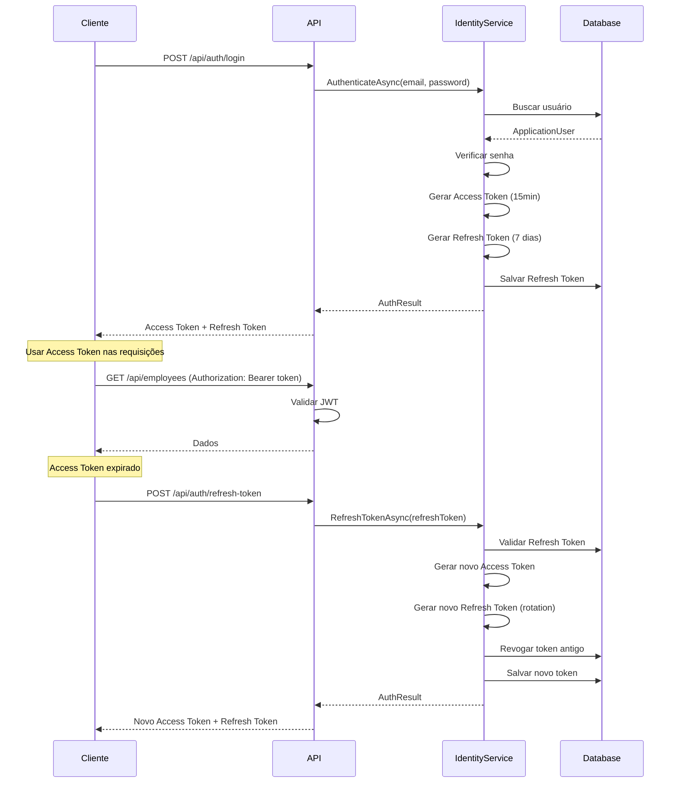
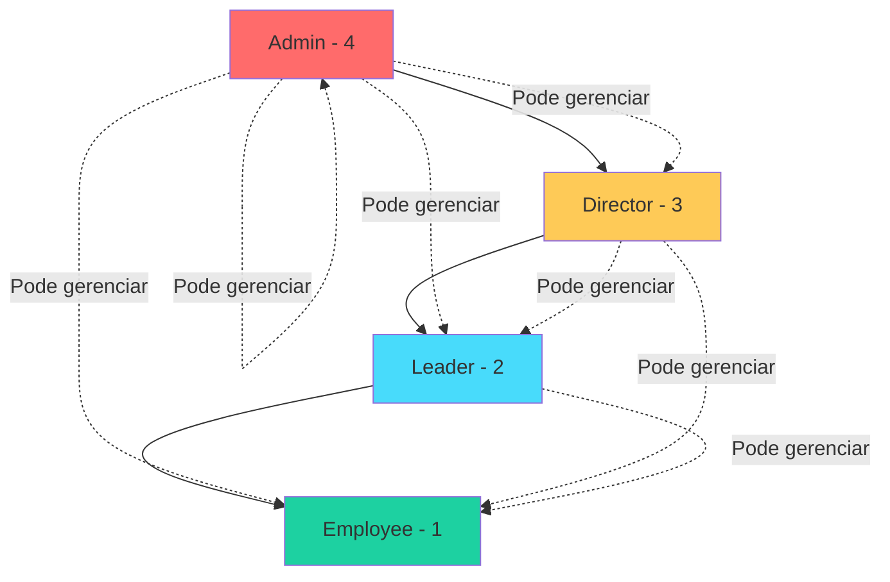

# Autenticação e Autorização

## Visão Geral

O sistema utiliza **JWT (JSON Web Tokens)** para autenticação stateless e **ASP.NET Identity** para gerenciamento de usuários e roles.

## Fluxo de Autenticação



## Hierarquia de Permissões



### Regras de Hierarquia

| Role | Nível | Pode Criar/Editar |
|------|-------|-------------------|
| **Admin** | 4 | Todos (incluindo outros Admins) |
| **Director** | 3 | Leader, Employee |
| **Leader** | 2 | Employee |
| **Employee** | 1 | Nenhum |

**Regra**: `CurrentUserRole > TargetRole`

## JWT (JSON Web Tokens)

### Access Token

**Validade**: 15 minutos  
**Uso**: Autenticação em cada requisição  
**Claims**:
- `sub` (NameIdentifier): User ID
- `email`: Email do usuário
- `role`: Roles do usuário
- `jti`: Token ID único

**Exemplo**:
```json
{
  "sub": "3fa85f64-5717-4562-b3fc-2c963f66afa6",
  "email": "admin@empresa.com",
  "role": ["Admin"],
  "jti": "7c9e6679-7425-40de-944b-e07fc1f90ae7",
  "exp": 1640000000,
  "iss": "EmployeeManagement.Api",
  "aud": "EmployeeManagement.Client"
}
```

### Refresh Token

**Validade**: 7 dias  
**Uso**: Renovar Access Token sem re-autenticar  
**Características**:
- Token opaco (não JWT)
- Armazenado no banco de dados
- **Token Rotation**: Cada refresh gera novo token e revoga o anterior
- Rastreamento de IP e timestamp

## Endpoints de Autenticação

### POST /api/auth/login

**Request**:
```json
{
  "email": "admin@empresa.com",
  "password": "Admin@123"
}
```

**Response** (200 OK):
```json
{
  "accessToken": "eyJhbGciOiJIUzI1NiIsInR5cCI6IkpXVCJ9...",
  "accessTokenExpiresAt": "2025-12-21T15:30:00Z",
  "refreshToken": "CfDJ8KtcOY...",
  "refreshTokenExpiresAt": "2025-12-28T14:30:00Z",
  "user": {
    "id": "3fa85f64-5717-4562-b3fc-2c963f66afa6",
    "email": "admin@empresa.com",
    "fullName": "Admin User",
    "roles": ["Admin"]
  }
}
```

### POST /api/auth/refresh-token

**Request**:
```json
{
  "refreshToken": "CfDJ8KtcOY..."
}
```

**Response**: Mesmo formato do login

### POST /api/auth/change-password

**Headers**: `Authorization: Bearer {accessToken}`

**Request**:
```json
{
  "currentPassword": "Admin@123",
  "newPassword": "NewAdmin@123"
}
```

**Response**: 204 No Content

### POST /api/auth/revoke-token

Revoga um refresh token específico (logout).

### POST /api/auth/revoke-all-tokens

Revoga todos os refresh tokens do usuário (logout de todas as sessões).

## Políticas de Autorização

Definidas na Infrastructure:

```csharp
services.AddAuthorizationBuilder()
    .AddPolicy("RequireAdmin", policy => 
        policy.RequireRole("Admin"))
    .AddPolicy("RequireDirector", policy => 
        policy.RequireRole("Director", "Admin"))
    .AddPolicy("RequireLeader", policy => 
        policy.RequireRole("Leader", "Director", "Admin"))
    .AddPolicy("RequireEmployee", policy => 
        policy.RequireRole("Employee", "Leader", "Director", "Admin"));
```

**Uso nos Controllers**:
```csharp
[Authorize(Policy = "RequireAdmin")]
public async Task<IActionResult> AdminOnlyAction() { }

[Authorize(Policy = "RequireLeader")]
public async Task<IActionResult> LeaderAndAbove() { }
```

## Segurança de Senha

### Requisitos

- Mínimo 8 caracteres
- Pelo menos 1 letra maiúscula
- Pelo menos 1 letra minúscula
- Pelo menos 1 número
- Pelo menos 1 caractere especial
- Não pode ser igual às últimas senhas

### Bloqueio de Conta

- **Tentativas máximas**: 5 falhas
- **Tempo de bloqueio**: 15 minutos
- **Reset automático**: Após tempo de bloqueio

## Credenciais Padrão (Seeding)

| Email | Senha | Role |
|-------|-------|------|
| admin@empresa.com | Admin@123 | Admin |
| director@empresa.com | Director@123 | Director |
| leader@empresa.com | Leader@123 | Leader |
| employee@empresa.com | Employee@123 | Employee |

> ⚠️ **Altere em produção!**

## Rate Limiting

### Política Geral
- **Limite**: 100 requisições/minuto
- **Fila**: 2 requisições

### Política de Login
- **Limite**: 5 requisições/minuto
- **Fila**: 0 (rejeita imediatamente)
- **Proteção**: Contra brute force

## Boas Práticas

✅ Usar HTTPS em produção  
✅ Armazenar tokens de forma segura (HttpOnly cookies ou secure storage)  
✅ Implementar refresh token rotation  
✅ Revogar tokens em logout  
✅ Validar expiração de tokens  
✅ Usar secrets management para chaves JWT  
✅ Implementar rate limiting  
✅ Registrar tentativas de login falhas  

## Próximos Passos

- [API Reference](12-API-REFERENCE.md) - Exemplos detalhados
- [Troubleshooting](15-TROUBLESHOOTING.md) - Problemas comuns

