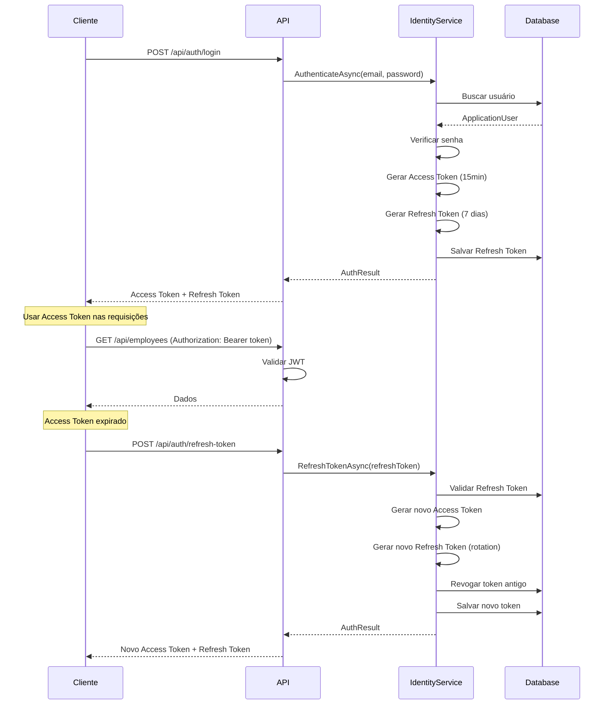
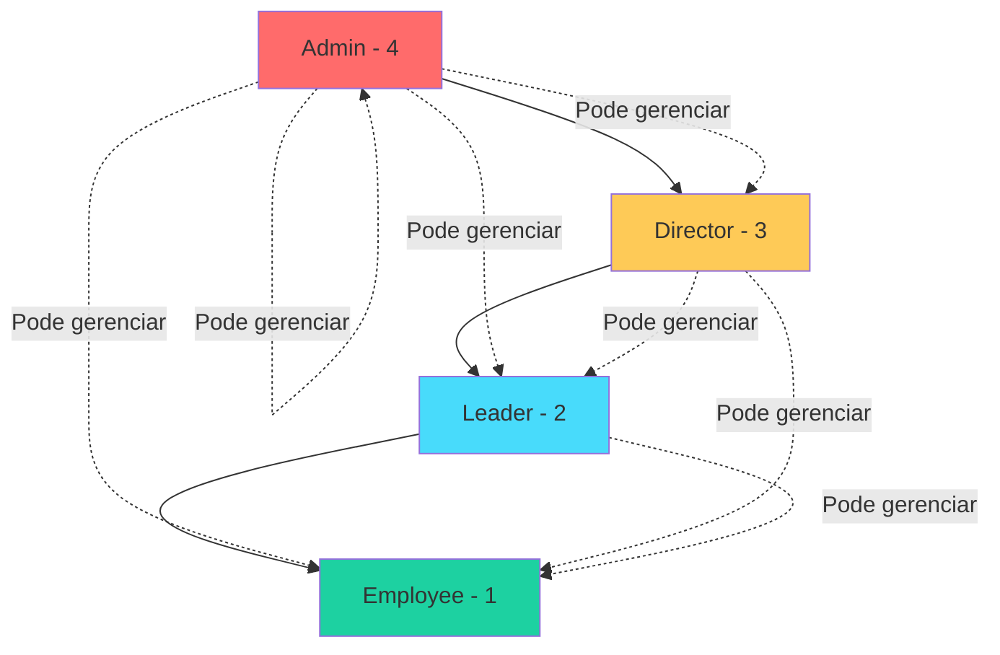
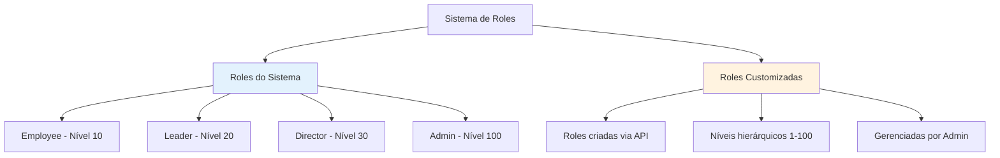

# Autenticação e Autorização

## Visão Geral

O sistema utiliza **JWT (JSON Web Tokens)** para autenticação stateless e **ASP.NET Identity** para gerenciamento de usuários e roles.

## Fluxo de Autenticação



## Hierarquia de Permissões



### Regras de Hierarquia

| Role | Nível | Pode Criar/Editar |
|------|-------|-------------------|
| **Admin** | 4 | Todos (incluindo outros Admins) |
| **Director** | 3 | Leader, Employee |
| **Leader** | 2 | Employee |
| **Employee** | 1 | Nenhum |

**Regra**: `CurrentUserRole > TargetRole`

## JWT (JSON Web Tokens)

### Access Token

**Validade**: 15 minutos  
**Uso**: Autenticação em cada requisição  
**Claims**:
- `sub` (NameIdentifier): User ID
- `email`: Email do usuário
- `role`: Roles do usuário
- `jti`: Token ID único

**Exemplo**:
```json
{
  "sub": "3fa85f64-5717-4562-b3fc-2c963f66afa6",
  "email": "admin@empresa.com",
  "role": ["Admin"],
  "jti": "7c9e6679-7425-40de-944b-e07fc1f90ae7",
  "exp": 1640000000,
  "iss": "EmployeeManagement.Api",
  "aud": "EmployeeManagement.Client"
}
```

### Refresh Token

**Validade**: 7 dias  
**Uso**: Renovar Access Token sem re-autenticar  
**Características**:
- Token opaco (não JWT)
- Armazenado no banco de dados
- **Token Rotation**: Cada refresh gera novo token e revoga o anterior
- Rastreamento de IP e timestamp

## Endpoints de Autenticação

### POST /api/auth/login

**Request**:
```json
{
  "email": "admin@empresa.com",
  "password": "Admin@123"
}
```

**Response** (200 OK):
```json
{
  "accessToken": "eyJhbGciOiJIUzI1NiIsInR5cCI6IkpXVCJ9...",
  "accessTokenExpiresAt": "2025-12-21T15:30:00Z",
  "refreshToken": "CfDJ8KtcOY...",
  "refreshTokenExpiresAt": "2025-12-28T14:30:00Z",
  "user": {
    "id": "3fa85f64-5717-4562-b3fc-2c963f66afa6",
    "email": "admin@empresa.com",
    "fullName": "Admin User",
    "roles": ["Admin"]
  }
}
```

### POST /api/auth/refresh-token

**Request**:
```json
{
  "refreshToken": "CfDJ8KtcOY..."
}
```

**Response**: Mesmo formato do login

### POST /api/auth/change-password

**Headers**: `Authorization: Bearer {accessToken}`

**Request**:
```json
{
  "currentPassword": "Admin@123",
  "newPassword": "NewAdmin@123"
}
```

**Response**: 204 No Content

### POST /api/auth/revoke-token

Revoga um refresh token específico (logout).

### POST /api/auth/revoke-all-tokens

Revoga todos os refresh tokens do usuário (logout de todas as sessões).

## Políticas de Autorização

Definidas na Infrastructure:

```csharp
services.AddAuthorizationBuilder()
    .AddPolicy("RequireAdmin", policy => 
        policy.RequireRole("Admin"))
    .AddPolicy("RequireDirector", policy => 
        policy.RequireRole("Director", "Admin"))
    .AddPolicy("RequireLeader", policy => 
        policy.RequireRole("Leader", "Director", "Admin"))
    .AddPolicy("RequireEmployee", policy => 
        policy.RequireRole("Employee", "Leader", "Director", "Admin"));
```

**Uso nos Controllers**:
```csharp
[Authorize(Policy = "RequireAdmin")]
public async Task<IActionResult> AdminOnlyAction() { }

[Authorize(Policy = "RequireLeader")]
public async Task<IActionResult> LeaderAndAbove() { }
```

## Segurança de Senha

### Requisitos

- Mínimo 8 caracteres
- Pelo menos 1 letra maiúscula
- Pelo menos 1 letra minúscula
- Pelo menos 1 número
- Pelo menos 1 caractere especial
- Não pode ser igual às últimas senhas

### Bloqueio de Conta

- **Tentativas máximas**: 5 falhas
- **Tempo de bloqueio**: 15 minutos
- **Reset automático**: Após tempo de bloqueio

## Credenciais Padrão (Seeding)

| Email | Senha | Role |
|-------|-------|------|
| admin@empresa.com | Admin@123 | Admin |
| director@empresa.com | Director@123 | Director |
| leader@empresa.com | Leader@123 | Leader |
| employee@empresa.com | Employee@123 | Employee |

> ⚠️ **Altere em produção!**

## Rate Limiting

### Política Geral
- **Limite**: 100 requisições/minuto
- **Fila**: 2 requisições

### Política de Login
- **Limite**: 5 requisições/minuto
- **Fila**: 0 (rejeita imediatamente)
- **Proteção**: Contra brute force

## Boas Práticas

✅ Usar HTTPS em produção  
✅ Armazenar tokens de forma segura (HttpOnly cookies ou secure storage)  
✅ Implementar refresh token rotation  
✅ Revogar tokens em logout  
✅ Validar expiração de tokens  
✅ Usar secrets management para chaves JWT  
✅ Implementar rate limiting  
✅ Registrar tentativas de login falhas  

## Sistema de Roles Dinâmicas

O sistema evoluiu de roles estáticas (enum) para um **sistema híbrido** que suporta roles customizadas além das 4 roles padrão do sistema.

### Arquitetura Híbrida



### CustomRole (Entidade)

A entidade `CustomRole` representa tanto roles do sistema quanto customizadas:

**Propriedades**:
- `Id`: Identificador único (GUID)
- `Name`: Nome interno (único, imutável)
- `DisplayName`: Nome de exibição (editável)
- `HierarchyLevel`: Nível hierárquico (1-100)
- `IsSystemRole`: Flag indicando se é role do sistema
- `LegacyRole`: Referência ao enum `Role` (apenas para roles do sistema)
- `Permissions`: Coleção de permissões associadas

**Níveis Hierárquicos Padrão**:
| Role | Nível | Tipo |
|------|-------|------|
| Employee | 10 | Sistema |
| Leader | 20 | Sistema |
| Director | 30 | Sistema |
| Admin | 100 | Sistema |
| *Customizadas* | 1-100 | Customizada |

### Regras de Hierarquia Dinâmica

A hierarquia é baseada em **níveis numéricos** ao invés de enum fixo:

```csharp
// Regra: Nível maior pode gerenciar nível menor
public bool CanManageRole(CustomRole targetRole)
{
    return HierarchyLevel > targetRole.HierarchyLevel;
}
```

**Exemplos**:
- Admin (100) pode gerenciar todos ✅
- Director (30) pode gerenciar Leader (20) ✅
- Leader (20) pode gerenciar Employee (10) ✅
- Role customizada (25) pode gerenciar Leader (20) ✅
- Employee (10) não pode gerenciar ninguém ❌

### Roles do Sistema vs Customizadas

| Característica | Roles do Sistema | Roles Customizadas |
|----------------|------------------|-------------------|
| **Quantidade** | 4 fixas | Ilimitadas |
| **Criação** | Seed do banco | API (Admin) |
| **Edição** | ❌ Não permitida | ✅ DisplayName e Nível |
| **Exclusão** | ❌ Não permitida | ✅ Permitida |
| **LegacyRole** | ✅ Mapeado para enum | ❌ Null |
| **IsSystemRole** | true | false |

### Endpoints de Gerenciamento

#### GET /api/v1/roles

Lista todos os roles (sistema + customizados).

**Autorização**: Requer Admin

**Response** (200 OK):
```json
[
  {
    "id": "11111111-1111-1111-1111-111111111111",
    "name": "Employee",
    "displayName": "Funcionário",
    "hierarchyLevel": 10,
    "isSystemRole": true
  },
  {
    "id": "22222222-2222-2222-2222-222222222222",
    "name": "Leader",
    "displayName": "Líder",
    "hierarchyLevel": 20,
    "isSystemRole": true
  },
  {
    "id": "550e8400-e29b-41d4-a716-446655440000",
    "name": "Supervisor",
    "displayName": "Supervisor de Área",
    "hierarchyLevel": 15,
    "isSystemRole": false
  }
]
```

#### GET /api/v1/roles/{id}

Obtém um role específico por ID.

**Autorização**: Requer Admin

**Response** (200 OK):
```json
{
  "id": "550e8400-e29b-41d4-a716-446655440000",
  "name": "Supervisor",
  "displayName": "Supervisor de Área",
  "hierarchyLevel": 15,
  "isSystemRole": false
}
```

#### POST /api/v1/roles

Cria um novo role customizado.

**Autorização**: Requer Admin

**Request**:
```json
{
  "name": "Supervisor",
  "displayName": "Supervisor de Área",
  "hierarchyLevel": 15
}
```

**Validações**:
- `name`: Obrigatório, único, não pode conflitar com roles do sistema
- `displayName`: Obrigatório
- `hierarchyLevel`: Entre 1 e 100

**Response** (201 Created):
```json
{
  "id": "550e8400-e29b-41d4-a716-446655440000",
  "name": "Supervisor",
  "displayName": "Supervisor de Área",
  "hierarchyLevel": 15,
  "isSystemRole": false
}
```

**Headers**:
```
Location: /api/v1/roles/550e8400-e29b-41d4-a716-446655440000
```

**Erros**:
- `400 Bad Request`: Dados inválidos
- `409 Conflict`: Nome já existe

#### PUT /api/v1/roles/{id}

Atualiza um role customizado (apenas `displayName` e `hierarchyLevel`).

**Autorização**: Requer Admin

**Request**:
```json
{
  "displayName": "Supervisor Sênior",
  "hierarchyLevel": 18
}
```

**Response**: `204 No Content`

**Erros**:
- `403 Forbidden`: Tentativa de editar role do sistema
- `404 Not Found`: Role não encontrado

#### DELETE /api/v1/roles/{id}

Remove um role customizado.

**Autorização**: Requer Admin

**Response**: `204 No Content`

**Erros**:
- `403 Forbidden`: Tentativa de deletar role do sistema
- `404 Not Found`: Role não encontrado

### RolePermission (Permissões Granulares)

Sistema preparado para permissões granulares por role:

**Estrutura**:
```csharp
public class RolePermission
{
    public Guid CustomRoleId { get; set; }
    public string Permission { get; set; }      // Ex: "employees.create"
    public string? Resource { get; set; }       // Ex: "employees"
}
```

**Exemplos de Permissões**:
- `employees.create`
- `employees.read`
- `employees.update`
- `employees.delete`
- `reports.view`
- `settings.manage`

> ⚠️ **Nota**: Sistema de permissões granulares está preparado mas não implementado. Atualmente usa apenas hierarquia de níveis.

### Migração de Enum para CustomRole

O sistema mantém **compatibilidade retroativa** com o enum `Role`:

```csharp
// Enum legado (ainda usado internamente)
public enum Role
{
    Employee = 1,
    Leader = 2,
    Director = 3,
    Admin = 4
}

// Mapeamento automático
CustomRole.LegacyRole → Role enum (apenas roles do sistema)
```

**Benefícios da Abordagem Híbrida**:
✅ Compatibilidade com código existente  
✅ Flexibilidade para criar novas roles  
✅ Migração gradual sem breaking changes  
✅ Hierarquia baseada em níveis numéricos  

### Casos de Uso

#### 1. Criar Role Intermediária

Empresa precisa de um cargo entre Leader e Director:

```json
POST /api/v1/roles
{
  "name": "Manager",
  "displayName": "Gerente",
  "hierarchyLevel": 25
}
```

Hierarquia resultante:
```
Admin (100) > Director (30) > Manager (25) > Leader (20) > Employee (10)
```

#### 2. Criar Role Especializada

Empresa precisa de um cargo técnico sem gestão de pessoas:

```json
POST /api/v1/roles
{
  "name": "TechLead",
  "displayName": "Líder Técnico",
  "hierarchyLevel": 22
}
```

#### 3. Ajustar Hierarquia

Aumentar nível de uma role customizada:

```json
PUT /api/v1/roles/{id}
{
  "displayName": "Gerente Sênior",
  "hierarchyLevel": 28
}
```

### Banco de Dados

**Tabela CustomRoles**:
```sql
CREATE TABLE CustomRoles (
    Id uniqueidentifier PRIMARY KEY,
    Name nvarchar(50) NOT NULL UNIQUE,
    DisplayName nvarchar(100) NOT NULL,
    HierarchyLevel int NOT NULL,
    IsSystemRole bit NOT NULL,
    LegacyRole int NULL,
    CONSTRAINT CK_HierarchyLevel CHECK (HierarchyLevel BETWEEN 1 AND 100)
);
```

**Tabela RolePermissions**:
```sql
CREATE TABLE RolePermissions (
    Id uniqueidentifier PRIMARY KEY,
    CustomRoleId uniqueidentifier NOT NULL,
    Permission nvarchar(100) NOT NULL,
    Resource nvarchar(100) NULL,
    FOREIGN KEY (CustomRoleId) REFERENCES CustomRoles(Id) ON DELETE CASCADE
);
```

### Boas Práticas

✅ **Planeje níveis hierárquicos**: Deixe espaço para roles futuras (ex: 10, 20, 30 ao invés de 1, 2, 3)  
✅ **Nomes descritivos**: Use `displayName` claro para usuários finais  
✅ **Não delete roles em uso**: Verifique se há funcionários com a role antes de deletar  
✅ **Documente permissões**: Mantenha registro de quais permissões cada role deve ter  
✅ **Teste hierarquia**: Valide que a hierarquia funciona como esperado após mudanças  

### Limitações Atuais

⚠️ Sistema de permissões granulares não implementado (apenas hierarquia)  
⚠️ Não há validação se role está em uso antes de deletar  
⚠️ Não há histórico de mudanças de roles  
⚠️ Frontend ainda usa enum estático  

### Roadmap

**Próximas Implementações**:
1. Sistema de permissões granulares completo
2. Validação de roles em uso antes de deletar
3. Histórico de mudanças de roles (auditoria)
4. Interface de gerenciamento no frontend
5. Importação/exportação de roles
6. Templates de roles por tipo de empresa

## Próximos Passos

- [API Reference](12-API-REFERENCE.md) - Exemplos detalhados
- [Troubleshooting](15-TROUBLESHOOTING.md) - Problemas comuns
- [Domínio](03-DOMINIO.md) - Entidades CustomRole e RolePermission

