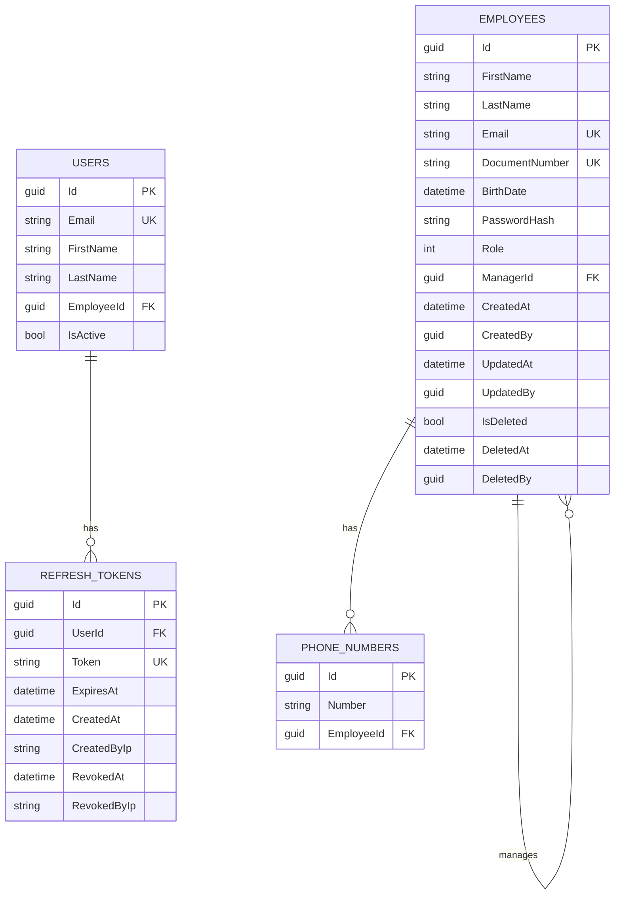

# Banco de Dados

## Visão Geral

O sistema utiliza **SQL Server 2022** como banco de dados relacional, gerenciado através do **Entity Framework Core 8**.

## Modelo de Dados



## Schemas

### dbo (Domínio)

Contém as tabelas de negócio:
- **Employees**: Funcionários
- **PhoneNumbers**: Telefones dos funcionários

### auth (Identidade)

Contém as tabelas do ASP.NET Identity:
- **Users**: Usuários do sistema
- **Roles**: Roles/Permissões
- **UserRoles**: Relacionamento usuário-role
- **RefreshTokens**: Tokens de renovação

## Tabelas Principais

### Employees

| Coluna | Tipo | Descrição |
|--------|------|-----------|
| Id | uniqueidentifier | PK, chave primária |
| FirstName | nvarchar(100) | Nome (obrigatório) |
| LastName | nvarchar(200) | Sobrenome (obrigatório) |
| Email | nvarchar(255) | Email único |
| DocumentNumber | nvarchar(20) | CPF/CNPJ único |
| BirthDate | datetime2 | Data de nascimento |
| PasswordHash | nvarchar(max) | Hash da senha |
| Role | int | Enum: 1=Employee, 2=Leader, 3=Director, 4=Admin |
| ManagerId | uniqueidentifier | FK para Employees (self-reference) |
| CreatedAt | datetime2 | Data de criação |
| CreatedBy | uniqueidentifier | Usuário que criou |
| UpdatedAt | datetime2 | Data de atualização |
| UpdatedBy | uniqueidentifier | Usuário que atualizou |
| IsDeleted | bit | Flag de soft delete |
| DeletedAt | datetime2 | Data de exclusão |
| DeletedBy | uniqueidentifier | Usuário que excluiu |

**Índices**:
- `IX_Employees_Email` (UNIQUE)
- `IX_Employees_DocumentNumber` (UNIQUE)
- `IX_Employees_ManagerId`

**Query Filter**:
```sql
WHERE IsDeleted = 0
```

### PhoneNumbers

| Coluna | Tipo | Descrição |
|--------|------|-----------|
| Id | uniqueidentifier | PK |
| Number | nvarchar(20) | Número do telefone |
| EmployeeId | uniqueidentifier | FK para Employees |

**Relacionamento**: CASCADE DELETE

### Users (auth schema)

| Coluna | Tipo | Descrição |
|--------|------|-----------|
| Id | uniqueidentifier | PK |
| Email | nvarchar(256) | Email único |
| FirstName | nvarchar(100) | Nome |
| LastName | nvarchar(100) | Sobrenome |
| EmployeeId | uniqueidentifier | FK para Employees |
| IsActive | bit | Status ativo/inativo |
| PasswordHash | nvarchar(max) | Hash da senha |
| SecurityStamp | nvarchar(max) | Stamp de segurança |
| AccessFailedCount | int | Contador de falhas |
| LockoutEnd | datetimeoffset | Fim do bloqueio |

### RefreshTokens (auth schema)

| Coluna | Tipo | Descrição |
|--------|------|-----------|
| Id | uniqueidentifier | PK |
| UserId | uniqueidentifier | FK para Users |
| Token | nvarchar(450) | Token único |
| ExpiresAt | datetime2 | Data de expiração |
| CreatedAt | datetime2 | Data de criação |
| CreatedByIp | nvarchar(50) | IP de origem |
| RevokedAt | datetime2 | Data de revogação |
| RevokedByIp | nvarchar(50) | IP que revogou |
| RevokedReason | nvarchar(200) | Motivo da revogação |
| ReplacedByToken | nvarchar(450) | Token substituto |

## Auditoria

Todas as entidades do domínio incluem campos de auditoria automática:

**Criação**:
- `CreatedAt`: Timestamp UTC da criação
- `CreatedBy`: GUID do usuário que criou

**Atualização**:
- `UpdatedAt`: Timestamp UTC da última atualização
- `UpdatedBy`: GUID do usuário que atualizou

**Exclusão (Soft Delete)**:
- `IsDeleted`: Flag booleana
- `DeletedAt`: Timestamp UTC da exclusão
- `DeletedBy`: GUID do usuário que excluiu

## Soft Delete

O sistema implementa **exclusão lógica**:

1. Ao excluir, `IsDeleted` é marcado como `true`
2. Campos `DeletedAt` e `DeletedBy` são preenchidos
3. Query Filter global oculta registros deletados
4. Dados preservados para auditoria

**Para consultar incluindo deletados**:
```csharp
var employees = await _context.Employees
    .IgnoreQueryFilters()
    .Where(e => e.IsDeleted)
    .ToListAsync();
```

## Migrations

### Criar Migration

```bash
dotnet ef migrations add NomeDaMigration --project src/EmployeeManagement/EmployeeManagement.Infrastructure --startup-project src/EmployeeManagement/EmployeeManagement.Api
```

### Aplicar Migrations

```bash
dotnet ef database update --project src/EmployeeManagement/EmployeeManagement.Infrastructure --startup-project src/EmployeeManagement/EmployeeManagement.Api
```

### Remover Última Migration

```bash
dotnet ef migrations remove --project src/EmployeeManagement/EmployeeManagement.Infrastructure --startup-project src/EmployeeManagement/EmployeeManagement.Api
```

## Seeding

### Dados Iniciais (DbSeeder)

O sistema é inicializado com dados de exemplo:

**Funcionários**:
- Admin, Director, Leader, Employee (um de cada role)
- Com telefones e hierarquia configurada

**Usuários Identity**:
- Um usuário para cada role
- Senhas padrão (Admin@123, etc.)

**Execução**:
- Automática na inicialização da aplicação
- Verifica se já existem dados antes de inserir

## Connection String

### Development

```json
{
  "ConnectionStrings": {
    "DefaultConnection": "Server=localhost,1433;Database=EmployeeManagementDb;User Id=sa;Password=SqlServer@123;TrustServerCertificate=True"
  }
}
```

### Docker

```json
{
  "ConnectionStrings": {
    "DefaultConnection": "Server=sqlserver,1433;Database=EmployeeManagement;User Id=sa;Password=SqlServer@123;TrustServerCertificate=True"
  }
}
```

### Production

Use **Azure Key Vault** ou **AWS Secrets Manager** para armazenar connection strings.

## Backup e Restore

### Backup Manual

```sql
BACKUP DATABASE EmployeeManagementDb
TO DISK = 'C:\Backups\EmployeeManagementDb.bak'
WITH FORMAT, INIT, NAME = 'Full Backup';
```

### Restore

```sql
RESTORE DATABASE EmployeeManagementDb
FROM DISK = 'C:\Backups\EmployeeManagementDb.bak'
WITH REPLACE;
```

## Performance

### Índices Criados

- Email (UNIQUE) - Busca rápida por email
- DocumentNumber (UNIQUE) - Busca rápida por documento
- ManagerId - Consultas de hierarquia
- IsDeleted - Query filter

### Otimizações

✅ Query filters para soft delete  
✅ Índices em colunas de busca frequente  
✅ Eager loading com `.Include()`  
✅ Paginação em todas as listagens  
✅ Cache de consultas frequentes  

## Próximos Passos

- [Infraestrutura](05-INFRAESTRUTURA.md) - Implementação do EF Core
- [Troubleshooting](15-TROUBLESHOOTING.md) - Problemas com banco de dados

