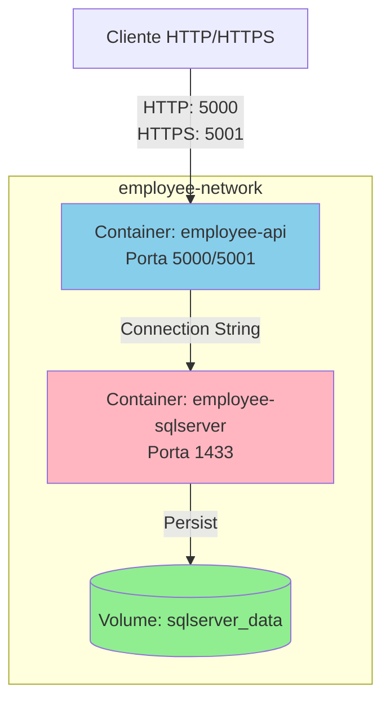

# Docker e Deploy

## Arquitetura Docker

O sistema utiliza Docker Compose para orquestrar dois containers principais:



## Serviços

### API Container

- **Imagem Base**: `mcr.microsoft.com/dotnet/aspnet:8.0`
- **Build**: Multi-stage com SDK 8.0
- **Nome**: `employee-api`
- **Portas**:
  - 5000 → 8080 (HTTP)
  - 5001 → 8081 (HTTPS)
- **Variáveis de Ambiente**:
  - `ASPNETCORE_ENVIRONMENT=Docker`
  - `ASPNETCORE_URLS=http://+:8080;https://+:8081`
  - Connection strings, JWT settings, etc.

### SQL Server Container

- **Imagem**: `mcr.microsoft.com/mssql/server:2022-latest`
- **Nome**: `employee-sqlserver`
- **Porta**: 1433
- **Credenciais**:
  - User: `sa`
  - Password: `SqlServer@123`
- **Volume**: `sqlserver_data` (persistência de dados)
- **Health Check**: Verifica conectividade a cada 10s

## docker-compose.yml

```yaml
services:
  sqlserver:
    image: mcr.microsoft.com/mssql/server:2022-latest
    container_name: employee-sqlserver
    environment:
      - ACCEPT_EULA=Y
      - MSSQL_SA_PASSWORD=SqlServer@123
      - MSSQL_PID=Developer
    ports:
      - "1433:1433"
    volumes:
      - sqlserver_data:/var/opt/mssql
    networks:
      - employee-network
    healthcheck:
      test: ["CMD-SHELL", "/opt/mssql-tools18/bin/sqlcmd -S localhost -U sa -P SqlServer@123 -C -Q 'SELECT 1' || exit 1"]
      interval: 10s
      timeout: 5s
      retries: 10
      start_period: 30s

  api:
    build:
      context: ./src
      dockerfile: EmployeeManagement/EmployeeManagement.Api/Dockerfile
    container_name: employee-api
    environment:
      - ASPNETCORE_ENVIRONMENT=Docker
      - ASPNETCORE_URLS=http://+:8080;https://+:8081
      - ASPNETCORE_Kestrel__Certificates__Default__Password=password
      - ASPNETCORE_Kestrel__Certificates__Default__Path=/https/aspnetapp.pfx
      - ConnectionStrings__DefaultConnection=Server=sqlserver,1433;Database=EmployeeManagement;User Id=sa;Password=SqlServer@123;TrustServerCertificate=True
      - Jwt__Secret=YourSuperSecretKeyWithAtLeast32Characters!
    ports:
      - "5000:8080"
      - "5001:8081"
    volumes:
      - ./certs:/https:ro
    networks:
      - employee-network
    depends_on:
      sqlserver:
        condition: service_healthy
    restart: unless-stopped

networks:
  employee-network:
    driver: bridge

volumes:
  sqlserver_data:
```

## Certificados SSL

### Gerar Certificado (Windows)

```powershell
.\scripts\generate-dev-cert.ps1
```

### Gerar Certificado (Linux/Mac)

```bash
chmod +x ./scripts/generate-dev-cert.sh
./scripts/generate-dev-cert.sh
```

O script cria:
- `certs/aspnetapp.pfx` - Certificado para o container
- Instala o certificado no sistema (Windows/Mac)

### Executar sem HTTPS

Use o override para HTTP apenas:

```bash
docker-compose -f docker-compose.yml -f docker-compose.http-only.yml up --build
```

## Comandos Docker

### Iniciar Containers

```bash
# Primeira vez (com build)
docker-compose up --build

# Iniciar em background
docker-compose up -d

# Apenas reconstruir a API
docker-compose up --build api
```

### Parar Containers

```bash
# Parar (preserva volumes)
docker-compose down

# Parar e remover volumes (APAGA DADOS!)
docker-compose down -v
```

### Logs

```bash
# Ver logs da API
docker logs -f employee-api

# Ver logs do SQL Server
docker logs -f employee-sqlserver

# Ver logs de ambos
docker-compose logs -f
```

### Acessar Container

```bash
# Entrar no container da API
docker exec -it employee-api /bin/bash

# Entrar no SQL Server
docker exec -it employee-sqlserver /bin/bash
```

### Limpar Tudo

```bash
# Remover containers, redes e volumes
docker-compose down -v

# Limpar imagens não utilizadas
docker system prune -a
```

## Dockerfile

```dockerfile
# Build stage
FROM mcr.microsoft.com/dotnet/sdk:8.0 AS build
ARG BUILD_CONFIGURATION=Release
WORKDIR /src

# Copy csproj files and restore
COPY src/EmployeeManagement/EmployeeManagement.Domain/*.csproj ./EmployeeManagement.Domain/
COPY src/EmployeeManagement/EmployeeManagement.Application/*.csproj ./EmployeeManagement.Application/
COPY src/EmployeeManagement/EmployeeManagement.Infrastructure/*.csproj ./EmployeeManagement.Infrastructure/
COPY src/EmployeeManagement/EmployeeManagement.Api/*.csproj ./EmployeeManagement.Api/

WORKDIR /src/EmployeeManagement.Api
RUN dotnet restore

# Copy source code
WORKDIR /src
COPY src/EmployeeManagement/EmployeeManagement.Application/ ./EmployeeManagement.Application/
COPY src/EmployeeManagement/EmployeeManagement.Domain/ ./EmployeeManagement.Domain/
COPY src/EmployeeManagement/EmployeeManagement.Infrastructure/ ./EmployeeManagement.Infrastructure/
COPY src/EmployeeManagement/EmployeeManagement.Api/ ./EmployeeManagement.Api/

# Build
WORKDIR /src/EmployeeManagement.Api
RUN dotnet publish -c $BUILD_CONFIGURATION -o /app/publish /p:UseAppHost=false

# Runtime stage
FROM mcr.microsoft.com/dotnet/aspnet:8.0 AS runtime
WORKDIR /app

EXPOSE 8080
EXPOSE 8081

COPY --from=build /app/publish .

ENTRYPOINT ["dotnet", "EmployeeManagement.Api.dll"]
```

## Variáveis de Ambiente

### Obrigatórias

| Variável | Descrição | Exemplo |
|----------|-----------|---------|
| `ConnectionStrings__DefaultConnection` | Connection string do SQL Server | `Server=sqlserver,1433;Database=...` |
| `Jwt__Secret` | Chave secreta JWT (mín. 32 chars) | `YourSuperSecretKey...` |

### Opcionais

| Variável | Descrição | Padrão |
|----------|-----------|--------|
| `ASPNETCORE_ENVIRONMENT` | Ambiente de execução | `Docker` |
| `Jwt__AccessTokenExpirationMinutes` | Expiração do access token | `15` |
| `Jwt__RefreshTokenExpirationDays` | Expiração do refresh token | `7` |
| `RateLimiting__EnableRateLimiting` | Habilitar rate limiting | `true` |
| `ConnectionStrings__Redis` | Connection string do Redis | (opcional) |

## Deploy em Produção

### Azure Container Instances

```bash
# Criar resource group
az group create --name employee-rg --location eastus

# Criar container registry
az acr create --resource-group employee-rg --name employeeacr --sku Basic

# Build e push da imagem
az acr build --registry employeeacr --image employee-api:latest .

# Deploy
az container create \
  --resource-group employee-rg \
  --name employee-api \
  --image employeeacr.azurecr.io/employee-api:latest \
  --dns-name-label employee-api \
  --ports 80 443
```

### Docker Swarm

```bash
# Inicializar swarm
docker swarm init

# Deploy do stack
docker stack deploy -c docker-compose.yml employee-stack

# Escalar API
docker service scale employee-stack_api=3
```

### Kubernetes

```yaml
apiVersion: apps/v1
kind: Deployment
metadata:
  name: employee-api
spec:
  replicas: 3
  selector:
    matchLabels:
      app: employee-api
  template:
    metadata:
      labels:
        app: employee-api
    spec:
      containers:
      - name: api
        image: employee-api:latest
        ports:
        - containerPort: 8080
        env:
        - name: ASPNETCORE_ENVIRONMENT
          value: "Production"
        - name: ConnectionStrings__DefaultConnection
          valueFrom:
            secretKeyRef:
              name: db-secret
              key: connection-string
```

## Health Checks

### Endpoint

```
GET /health
```

**Response**:
```json
{
  "status": "Healthy",
  "checks": [
    {
      "name": "database",
      "status": "Healthy",
      "duration": 45.2
    },
    {
      "name": "identity-database",
      "status": "Healthy",
      "duration": 38.7
    }
  ]
}
```

## Troubleshooting Docker

### Container não inicia

```bash
# Ver logs detalhados
docker logs employee-api

# Verificar health check
docker inspect employee-sqlserver | grep -A 10 Health
```

### Erro de conexão com SQL Server

1. Verificar se SQL Server está healthy:
```bash
docker ps
```

2. Testar conexão manualmente:
```bash
docker exec -it employee-sqlserver /opt/mssql-tools18/bin/sqlcmd \
  -S localhost -U sa -P SqlServer@123 -C -Q "SELECT 1"
```

### Certificado SSL inválido

1. Regenerar certificado:
```bash
.\scripts\generate-dev-cert.ps1
```

2. Reconstruir container:
```bash
docker-compose up --build api
```

## Próximos Passos

- [Configuração](11-CONFIGURACAO.md)
- [Guia de Desenvolvimento](13-GUIA-DESENVOLVIMENTO.md)
- [Troubleshooting](15-TROUBLESHOOTING.md)

